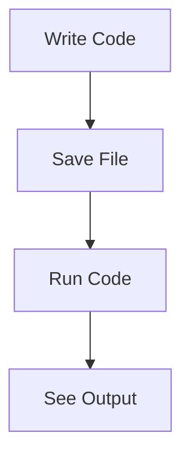

# Lesson 4, Step 1: Unleash Your Code Wizardry! 🧙‍♂️✨

Welcome to the first step of setting up your Python project environment! This is where the magic begins, Mathletes! Let's transform your computer into a coding castle where Python spells come to life. 🏰🐍

## 🔑 Key Action: Install Python and Your Magic Wand (Code Editor) 🎩✏️

### Step 1: Summon Python to Your Computer 🐍🔮

Before any wizard can cast spells, they need their spellbook. In our case, that's Python! Follow these simple steps to get started:

1. **Visit the Python Spellbook Library**: Go to [python.org](https://www.python.org/downloads/).
2. **Choose Your Spellbook Version**: Select the latest version suitable for your operating system (Windows, macOS, or Linux).
3. **Cast the Installation Spell**: Click "Download" and follow the magical setup instructions. Make sure to check "Add Python to PATH" during installation so your spells can be cast from anywhere!

### Step 2: Choose Your Magic Wand (Code Editor) ✨

Great wizards have powerful wands. For coding, your wand is your code editor. Let's pick one that suits your style:

- **Visual Studio Code**: A Swiss Army knife of coding. Download it from [code.visualstudio.com](https://code.visualstudio.com/).
- **PyCharm**: Tailored for Python sorcery. Available at [jetbrains.com/pycharm](https://www.jetbrains.com/pycharm/).
- **Thonny**: Simple and elegant for budding wizards. Visit [thonny.org](https://thonny.org/).

### Step 3: Draw Your First Rune (Hello World Script) ⚡

Let's ensure your setup is ready by casting a simple Python spell:

```python
# Your first spell
print("Hello, Mathletes! Ready to conjure some code?")
```

#### Instructions:
1. **Open Your Code Editor**: Launch the editor you just installed.
2. **Create a New Spell (File)**: Open a new file and type the code above.
3. **Save Your Spell**: Name it `magic_intro.py`.
4. **Cast the Spell**: Run the file and watch the magic happen!

### Flow of Magic: How Code Runs 🌀

Here's a simple flow diagram to show how your code turns into action:



## 🎉 Celebrate Your Success!

Great job! You've just set up your coding environment and cast your first spell. Remember, every great wizard starts with small spells and grows to cast mighty enchantments! Keep practicing, and soon you'll be creating magic of your own.

Next, we'll dive into your project files and explore the enchanted world of Python coding! Until then, keep your wand sharp and your spellbook handy. 🧙‍♀️✨

Stay curious and keep coding! 🚀🔍