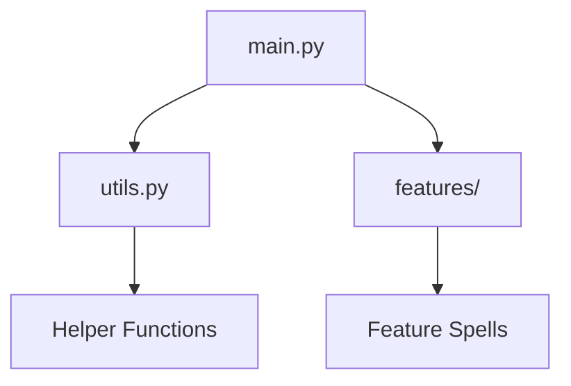

# Lesson 4, Step 2: Explore Your Coding Castle! 🏰✨

Welcome back, brave Mathletes! With your magical tools installed, it's time to step inside your coding castle and explore the wonders within. Let’s uncover the secrets of your project files and become masters of the coding realm! 🧙‍♂️🔍

## 🔍 Key Action: Navigate Your Project Structure 🗺️

Every great wizard knows their kingdom well. In the coding world, your kingdom is your project structure. Let’s embark on an expedition to understand the magical layers of your project!

### Step 1: Enter the Castle's Main Hall - `main.py` 🚪

The `main.py` file is your grand entrance, the starting point of your adventure! It’s where you’ll write your main spells that bring your project to life. Let’s try a spell to make sure the magic flows:

```python
# Grand entrance spell
print("Welcome, Mathletes, to your coding castle!")
```

#### Instructions:
1. **Open `main.py`**: Find this file in your project directory.
2. **Type the Spell**: Write the code above inside the file.
3. **Save & Cast the Spell**: Save your changes and run the file to see your message light up the screen!

### Step 2: Discover the Wizard's Toolbox - `utils.py` 🧰

In every castle, there's a hidden room full of tools. The `utils.py` is just that – your handy toolbox! Here, you'll store helper spells and functions that you can use throughout your project.

#### Add a Simple Tool:

Let's add a magical tool to greet our fellow wizards:

```python
# A friendly wizard greeting

def greet_wizard(name):
    print(f"Hello, {name}! Ready to explore the magic?")
```

1. **Open `utils.py`**: Locate this file in your directory.
2. **Add the Tool**: Type the function code above.
3. **Save Your Work**: Don't forget to save your changes!

### Step 3: Uncover the Enchanted Chambers - `features/` 🔮

Every great adventure includes special quests. The `features/` folder is where you'll create unique spells and features to expand your project.

#### Create a New Feature:

Let’s start a new magic journey by creating a spell in `feature1.py`:

```python
# Feature spell

def feature_magic():
    print("This is just the beginning of your magical journey!")
```

1. **Open or Create `feature1.py`**: Inside the `features/` folder.
2. **Type the Spell**: Write the code above.
3. **Save the Adventure**: Secure your work by saving the file.

### Flow of Magic: How Features Come Alive 🌀

Here’s how your project structure supports the magic:



## 🎉 Celebrate Your Discoveries!

You've explored the depths of your coding castle, and now you know where to find your magical tools and mystical chambers. This knowledge will serve you well in your coding quests! Keep this map handy as you continue to learn and grow.

In the next steps, we’ll start using these tools and features to create our first magical project! Until then, keep your spells sharp and your imagination wild. 🚀🌟

Happy exploring, young wizards! 🎈🔍