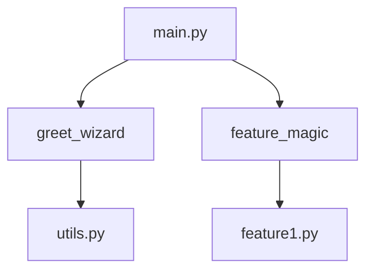

# Lesson 4, Step 3: Ignite Your Coding Adventure! 🔥🌟

Welcome back, intrepid Mathletes! With your coding castle explored and your tools in hand, it’s time to light the spark of your first grand adventure in Python. Get ready to combine your newfound skills and create magic that dances across the screen! 🏰💫

## 🚀 Key Action: Combine Your Magic Spells 🔮

Wizards don't just learn spells—they weave them into powerful enchantments! Let’s bring together the elements of your project and make something truly magical happen.

### Step 1: Weave Spells Together in `main.py` 🎨

It’s time to combine the spells and tools you’ve crafted into a harmonious masterpiece in `main.py`. Let’s create a magical greeting that uses your wizard toolbox!

#### Combine Your Spells:

Open `main.py` and use the function from `utils.py` to greet the world:

```python
# Combine spells to create a magical greeting
from utils import greet_wizard

greet_wizard("Mathlete Wizard")
```

#### Instructions:
1. **Open `main.py`**: This is your magical canvas.
2. **Invoke Your Tools**: Use the `import` statement to bring in your wizard greeting tool.
3. **Cast the Combined Spell**: Type the code above, save, and run it to see the magic unfold!

### Step 2: Enchant Your Features ✨

Let’s bring your first feature to life using the spell you created in `feature1.py`.

#### Activate the Feature:

Modify `feature1.py` to include the ability to ask for a wizard's name and greet them:

```python
# Enhanced feature spell

def feature_magic():
    name = input("Enter your wizard name: ")
    print(f"Welcome, {name}, to the magical world of Mathletes!")
```

1. **Open `feature1.py`**: Time to enhance the spell.
2. **Add User Interaction**: Use `input` to ask for a wizard’s name.
3. **Run & Enjoy**: Save and run your code to see personalized magic!

### Flow of Magic: Bringing It All to Life 🌀

Here’s how your spells, tools, and features come together to create magic:



## 🎉 Celebrate Your Magical Creations!

Congratulations, Mathletes! You’ve successfully woven your spells and brought your coding project to life. Remember, the magic of coding is just beginning—there’s a universe of possibilities waiting to be explored.

In the next lessons, you’ll learn how to build even more complex spells and enchantments, combining math and code to create wonders. Until then, keep experimenting, stay curious, and let your imagination soar! 🚀🌌

Happy coding, magical wizards! 🧙‍♀️✨