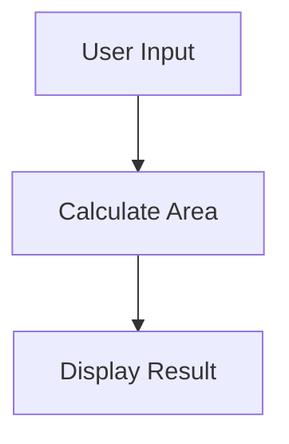

# Lesson 5: Implementing Core Features 🛠️✨

Welcome back, Mathletes! 🌟 Today, we're diving deep into the heart of our project. It's time to bring your Python skills to life by implementing the core features of your geometry adventure. Ready to flex those coding muscles? Let's go! 🚀

## Lesson Overview

In this lesson, you'll learn how to:
- Develop core functionalities with geometric calculations 📐
- Create interactive user experiences 💬
- Write efficient and effective code to tackle mathematical challenges 🎯

By the end of this lesson, you'll have a solid foundation to build and expand upon your project. Let's make some magic happen! 🧙‍♂️✨

## Why Core Features Matter

Imagine you're building a castle. The core features are like your strong foundation and sturdy walls—they keep everything standing tall and functional! In our coding adventure, these features are crucial for a successful project. 🏰

## Getting Started: Coding the Core

### 1. Geometric Calculations 📏

Let's start with some geometric magic! We'll create functions to perform calculations, such as finding the area and perimeter of shapes. Here's how you can write these calculations:

```python
# Function to calculate the area of a rectangle

def calculate_rectangle_area(length, width):
    return length * width

# Function to calculate the perimeter of a rectangle

def calculate_rectangle_perimeter(length, width):
    return 2 * (length + width)
```

#### Instructions:
1. **Open `utils.py`**: This is where your geometry spells will live.
2. **Add the Functions**: Type the code above to create your geometric tools.
3. **Test Your Functions**: Try using these functions in `main.py` and print the results to ensure they're working correctly.

### 2. User Interaction 🎤

Now, let's make your project interactive! We want users to input data and get results, just like a magical dialogue with your computer.

```python
# Interactive function to get user input and calculate area

def interactive_geometry():
    length = float(input("Enter the length of the rectangle: "))
    width = float(input("Enter the width of the rectangle: "))
    area = calculate_rectangle_area(length, width)
    print(f"The area of the rectangle is {area}.")
```

#### Instructions:
1. **Open `main.py`**: This is where you'll orchestrate the interactive magic.
2. **Import Functions**: Use `from utils import calculate_rectangle_area` to bring your geometry functions into the file.
3. **Add the Interactive Function**: Type the code above and run it to see the magic in action!

### Flow of Magic: How Core Features Work Together 🌀

Here's a flow diagram to show how your core features interact to create a seamless user experience:



## 🎉 Celebrate Your Progress!

You've successfully implemented the core features of your project! These are the building blocks that will support your future coding endeavors. Your project can now perform calculations and interact with users, making it both functional and engaging. Keep up the great work! 🌟

In the next lessons, you'll expand these features and add even more complexity and creativity to your project. Until then, keep coding, stay curious, and most importantly, have fun! 🚀🔍

Happy coding, Mathletes! 🎈✨