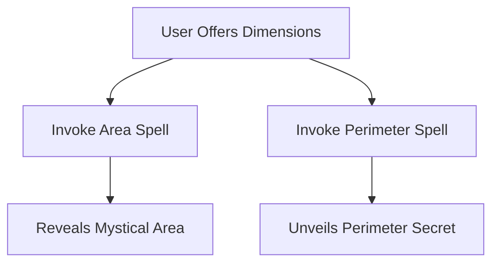

# 🎯 Lesson Step 1: Unleash Your Geometric Wizardry! ✨🔮

Welcome, young wizards and witches of the coding realm! 🧙‍♀️🧙‍♂️ Today, we embark on an enchanting journey to master the magical arts of geometry. Are you ready to cast your first spell and bring shapes to life? Let's conjure up some core features that will make your project truly magical! 🌟

## 🛠️ Step 1: Crafting Your First Spell - The **Shape Scribe** ✒️

### 📏 **The Rectangle Ritual**

Our first spell involves the mystical art of calculating the area and perimeter of a rectangle. These spells (or functions, if you will) are the foundation stones of your geometric knowledge. Let's start by crafting these spells:

```python
# The Rectangle Area Spell

def calculate_rectangle_area(length, width):
    """
    Casts a spell to calculate the area of a rectangle.
    """
    return length * width

# The Rectangle Perimeter Spell

def calculate_rectangle_perimeter(length, width):
    """
    Conjures the perimeter of a rectangle.
    """
    return 2 * (length + width)
```

#### 🎲 **Your Mission**:
1. **Open `utils.py`**: This is your spell book where all magic begins. 🌌
2. **Transcribe the Spells**: Copy the code snippets above into your `utils.py`. Feel the magic flow through your fingertips! ✍️
3. **Test Your Spells**: In `main.py`, use `from utils import calculate_rectangle_area` to summon your spells and test them out! Print the results to see your magic take shape. 🧙‍♀️✨

### 🌀 **Visualizing the Magic: Flow of Energy**

Let's dive into the essence of magic with a flow diagram that shows how your spells work together to create a powerful force:



## 🎉 **Celebrate Your Magical Achievements!**

You've successfully woven your first spells into the tapestry of your project! These spells are not just lines of code; they're the magic that turns your project into an interactive adventure. Keep practicing your spells; soon, you'll be casting even more complex enchantments! 🌌🔮

Remember, every great wizard started just like you—by learning the basics and building up their spellbook. Keep your wand sharp and your mind sharper. Until our next lesson, keep experimenting and exploring the vast world of code! 🌟🚀

Happy coding, Mathletes! 🎈✨