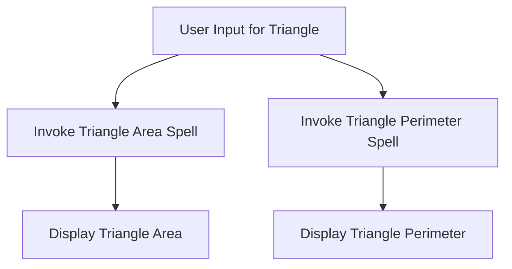

# 🔍 Lesson Step 2: Dive Deeper into the Magic Pool! 🌊✨

Welcome back, magical coders! 🎩✨ You're doing an amazing job mastering the art of geometry. Now, it's time to dive even deeper into the magical pool of knowledge. Let's explore more enchanting spells that will make your project shine brighter than ever! 🌟

## 🛠️ Step 2: Enchanting Your Project with New Spells 🔮

### 📐 **The Triangle Transformation**

After mastering rectangles, it's time to spread your wings and tackle triangles! 🦅 Let's create spells to calculate the area and perimeter of a triangle. These are crucial spells in your geometry grimoire.

```python
# The Triangle Area Spell

def calculate_triangle_area(base, height):
    """
    Casts a spell to calculate the area of a triangle.
    """
    return 0.5 * base * height

# The Triangle Perimeter Spell

def calculate_triangle_perimeter(side1, side2, side3):
    """
    Conjures the perimeter of a triangle.
    """
    return side1 + side2 + side3
```

#### 🎲 **Your Mission**:
1. **Open `utils.py`**: This is where you'll continue building your spell collection. 📜
2. **Transcribe the Triangle Spells**: Add the code snippets above to your `utils.py`. Feel the magic grow as your code expands! 📈✨
3. **Test Your Spells**: Dive into `main.py` and expand your testing! Use `from utils import calculate_triangle_area` to try out your new spells. Print the results and watch the magic unfold! 🧙‍♂️💫

### 🔄 **Flow of Enchantments: How Spells Interact**

Here's how your spells interact to create a seamless and magical user experience:



## 🌟 **Unlocking the Power of Interactive Magic**

Now, let's add more depth to your interactive functions! We'll make your project even more engaging by allowing users to choose which geometric shape they'd like to explore.

```python
# Interactive function to choose shape and calculate properties

def interactive_geometry_expanded():
    print("Choose a shape to explore: 1) Rectangle 2) Triangle")
    choice = input("Enter 1 or 2: ")

    if choice == '1':
        length = float(input("Enter the length of the rectangle: "))
        width = float(input("Enter the width of the rectangle: "))
        area = calculate_rectangle_area(length, width)
        perimeter = calculate_rectangle_perimeter(length, width)
        print(f"The area of the rectangle is {area} and the perimeter is {perimeter}.")

    elif choice == '2':
        base = float(input("Enter the base of the triangle: "))
        height = float(input("Enter the height of the triangle: "))
        side1 = float(input("Enter the first side of the triangle: "))
        side2 = float(input("Enter the second side of the triangle: "))
        side3 = float(input("Enter the third side of the triangle: "))
        area = calculate_triangle_area(base, height)
        perimeter = calculate_triangle_perimeter(side1, side2, side3)
        print(f"The area of the triangle is {area} and the perimeter is {perimeter}.")
    else:
        print("Oops! That's not a valid choice. Please try again.")
```

#### 🎲 **Your Mission**:
1. **Enhance `main.py`**: Add this interactive function to allow users to choose their geometric adventure. 🏞️
2. **Test the Expansion**: Run your program, make a choice, and see the magic happen with different shapes! 🧙‍♀️✨

## 🎉 **Celebrate Your Expanding Magical Powers!**

You've added new spells and expanded your interactive magic toolkit. More shapes, more fun, more magic! 🎇 Keep experimenting, and soon you'll be a master of geometric enchantments.

In the upcoming lessons, you'll learn even more spells and explore new realms of coding magic. Until then, keep practicing, stay curious, and let your imagination soar! 🌌🚀

Happy coding, Mathletes! 🎈✨