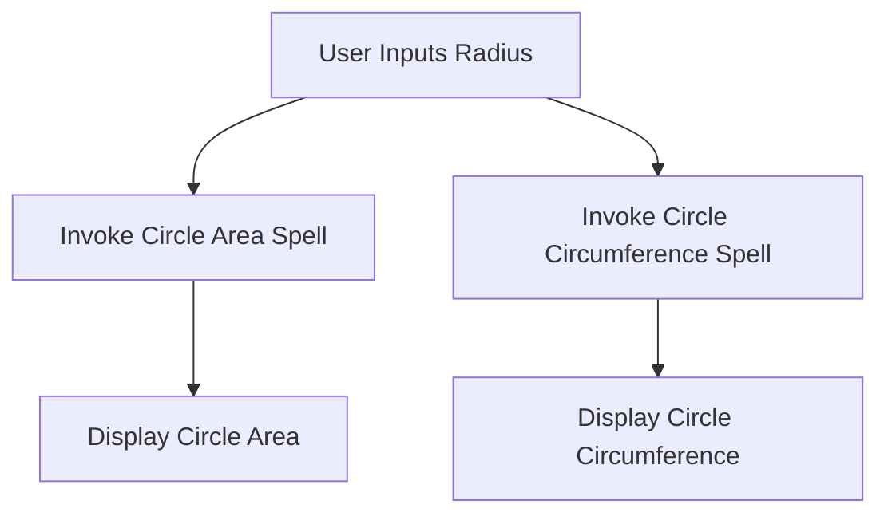

# 🌌 Lesson Step 3: Mastering the Art of Geometry Magic! ✨🔮

Welcome back, Mathletes and budding wizards of code! 🧙‍♂️✨ You've done a phenomenal job so far, mastering rectangles and triangles. But the journey doesn't end here! Are you ready to level up your magical prowess and explore even more wonders of the geometric world? Let's dive right in! 🚀

## 🛠️ Step 3: Expanding Your Spellbook with Circles and Beyond 🌀

### 🔵 **The Circle Sorcery**

It's time to add the enchantment of circles to your spellbook! Circles are everywhere around us, from the wheels of a car to the face of a clock. Let's create spells to calculate the area and circumference of a circle. These spells will add a new dimension to your magical toolkit.

```python
# The Circle Area Spell

def calculate_circle_area(radius):
    """
    Casts a spell to calculate the area of a circle.
    """
    import math
    return math.pi * (radius ** 2)

# The Circle Circumference Spell

def calculate_circle_circumference(radius):
    """
    Conjures the circumference of a circle.
    """
    import math
    return 2 * math.pi * radius
```

#### 🎲 **Your Mission**:
1. **Open `utils.py`**: Add these new circle spells to your expanding collection. 🌀
2. **Test Your Circle Spells**: Jump into `main.py` and import your new spells with `from utils import calculate_circle_area, calculate_circle_circumference`. Test them out by printing the results. 🌟

### 🔄 **The Circle of Magic: How It Flows**

Here's a magical diagram to illustrate how your new circle spells interact to create an enchanting experience:



## 🌟 **Unlocking the Secrets of Advanced Interactivity**

Let's make your project even more interactive and user-friendly! We'll design a system where users can choose any shape they want to explore. 

```python
# Interactive function for diverse geometric adventures!

def interactive_geometry_advanced():
    print("Choose a shape to explore: 1) Rectangle 2) Triangle 3) Circle")
    choice = input("Enter 1, 2, or 3: ")

    if choice == '1':
        # Rectangle magic
        length = float(input("Enter the length of the rectangle: "))
        width = float(input("Enter the width of the rectangle: "))
        area = calculate_rectangle_area(length, width)
        perimeter = calculate_rectangle_perimeter(length, width)
        print(f"The area of the rectangle is {area} and the perimeter is {perimeter}.")

    elif choice == '2':
        # Triangle magic
        base = float(input("Enter the base of the triangle: "))
        height = float(input("Enter the height of the triangle: "))
        side1 = float(input("Enter the first side of the triangle: "))
        side2 = float(input("Enter the second side of the triangle: "))
        side3 = float(input("Enter the third side of the triangle: "))
        area = calculate_triangle_area(base, height)
        perimeter = calculate_triangle_perimeter(side1, side2, side3)
        print(f"The area of the triangle is {area} and the perimeter is {perimeter}.")

    elif choice == '3':
        # Circle magic
        radius = float(input("Enter the radius of the circle: "))
        area = calculate_circle_area(radius)
        circumference = calculate_circle_circumference(radius)
        print(f"The area of the circle is {area} and the circumference is {circumference}.")

    else:
        print("Oops! That's not a valid choice. Please try again.")
```

#### 🎲 **Your Mission**:
1. **Enhance `main.py`**: Add this advanced interactive function to your project. 🔍
2. **Test the Adventure**: Run your program and explore the magical possibilities with each shape! 🧙‍♂️✨

## 🎉 **Celebrate Your Supreme Geometric Wizardry!**

Congratulations, Mathletes! You've expanded your mystical abilities to include circles and created an interactive experience that can guide users through a magical world of geometry. 🚀

In future lessons, you'll continue to enhance your coding skills, learn new spells, and maybe even create your own magical geometry world! Keep practicing, keep experimenting, and keep having fun! 🌟✨

Happy coding, Mathletes! 🎈✨