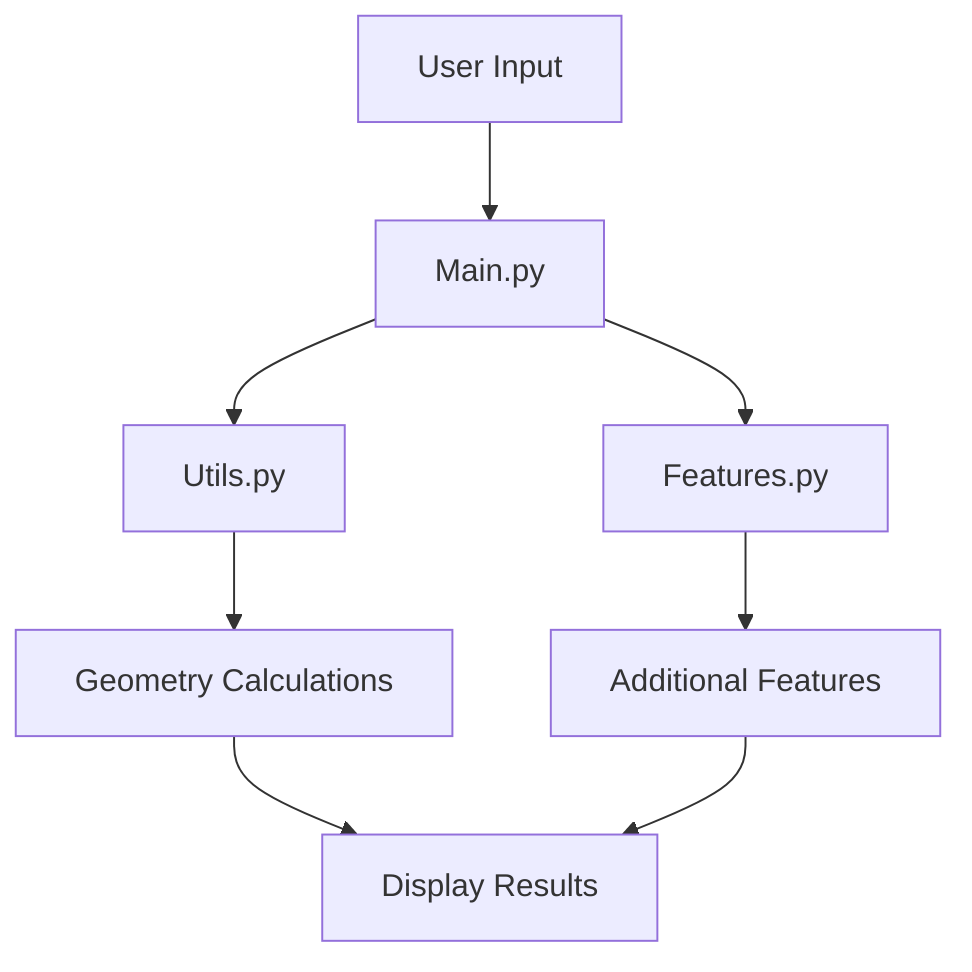

# Lesson 6: Integrating Modules and Features 🔗✨

Welcome back, mighty Mathletes! 🌟 In this exciting lesson, we're taking a grand leap into the world of integration and synthesis. Imagine you're assembling a puzzle, and each piece is a module or feature of your Python project. Today, we'll learn how to fit these pieces together to create a masterpiece. Ready to see your project come to life? Let's dive in! 🚀

## Lesson Overview

In this lesson, you'll learn how to:
- Integrate different modules and features into a cohesive application 🔧
- Understand the importance of each module in the overall project structure 🧩
- Debug and test integrated code for seamless operation 🛠️

By the end of this lesson, your Python geometry adventure will be a well-oiled machine, ready to tackle any challenge. Let's get started! 🎯

## Why Integration Matters

Think of your project like a big, delicious cake. 🍰 Each module is an ingredient, and integration is the process of mixing them to create something delightful. Without proper integration, your project might crumble under pressure. But fear not, we're here to ensure your project stands tall and proud! 🏰

## Step 1: Organizing Your Modules 📂

Before we start integrating, let's ensure our project is well-organized:

### Project Structure:

```plaintext
mathletes_project/
├── main.py
├── utils.py
├── features.py
└── modules/
    ├── geometry_tools.py
    ├── user_interaction.py
    └── visualization.py
```

- **`main.py`**: The heart of your project where everything comes together.
- **`utils.py`**: Home for your geometry spells and calculations.
- **`features.py`**: Where additional features and functionalities are developed.
- **`modules/`**: A treasure chest of specialized tools and scripts.

## Step 2: Importing Modules and Functions 🧙‍♂️

Let's learn how to import and use the functions from different modules. This is like calling upon different wizards to cast spells in harmony!

```python
# In main.py
from utils import calculate_rectangle_area, calculate_triangle_area
from modules.geometry_tools import calculate_circle_area

# Use the imported functions
def main():
    length = 5
    width = 3
    area_rect = calculate_rectangle_area(length, width)
    print(f"Rectangle Area: {area_rect}")

    base = 4
    height = 3
    area_tri = calculate_triangle_area(base, height)
    print(f"Triangle Area: {area_tri}")

    radius = 2
    area_cir = calculate_circle_area(radius)
    print(f"Circle Area: {area_cir}")

if __name__ == "__main__":
    main()
```

#### Instructions:
1. **Open `main.py`**: This is where all the action happens!
2. **Add Import Statements**: Copy the import lines and use your functions seamlessly.
3. **Run Your Program**: See the magic as all parts of your project work together! 🌟

## Step 3: Debugging and Testing 🐞🔍

Integration isn't just about putting things together; it's also about ensuring everything works harmoniously. Let's debug and test!

### Common Debugging Tips:
- **Print Statements**: Use them liberally to understand the flow of your program.
- **Step-by-step Execution**: Break down your program and test each part independently.
- **Error Messages**: Read them carefully, they often point directly to the problem!

```python
# Example of debugging with print statements
print("Starting calculation...")
area = calculate_rectangle_area(10, 5)
print(f"Calculated area: {area}")
```

#### Instructions:
1. **Test Each Module**: Run your tests and ensure each module works as expected.
2. **Look for Bugs**: Debug any issues that arise during integration.
3. **Celebrate Your Success**: Enjoy the moment when your project runs smoothly! 🎉

## Flow of Integration: How Everything Fits Together 🌀

Let's visualize how your modules and features interact in your project:



## 🎉 Celebrate Your Coding Symphony!

Congratulations, Mathletes! You've successfully integrated your modules and features into a harmonious project. This is a significant milestone in your coding journey, and you should be proud of your accomplishments. Keep experimenting and continue to build upon your project.

In future lessons, we'll explore more advanced topics and enhance your project's capabilities even further. Until then, keep coding, stay curious, and most importantly, have fun! 🚀🔍

Happy coding, Mathletes! 🎈✨