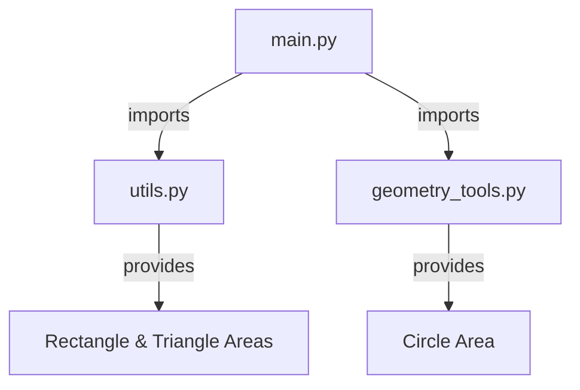

## Step 2: Importing Modules and Functions 🧙‍♂️🔮

Now that your magical kingdom is organized and each realm knows its place, it's time to summon the powers of each module! Just like calling upon different wizards to perform their unique spells, you're going to import functions from different modules. Let's make some magic happen! ✨

### Summoning Your Wizards: Importing Functions

In the realm of Python, importing functions is akin to calling your trusted advisors to the council. Here's how you do it:

```python
# In main.py
from utils import calculate_rectangle_area, calculate_triangle_area
from modules.geometry_tools import calculate_circle_area

# Use the imported functions
def main():
    length = 5
    width = 3
    area_rect = calculate_rectangle_area(length, width)
    print(f"Rectangle Area: {area_rect}")

    base = 4
    height = 3
    area_tri = calculate_triangle_area(base, height)
    print(f"Triangle Area: {area_tri}")

    radius = 2
    area_cir = calculate_circle_area(radius)
    print(f"Circle Area: {area_cir}")

if __name__ == "__main__":
    main()
```

### Learn the Magic Words: Import Statements

- **`from utils import calculate_rectangle_area, calculate_triangle_area`**: This brings the spells for calculating areas of rectangles and triangles from `utils.py`.
- **`from modules.geometry_tools import calculate_circle_area`**: This calls upon the circle area spell from `geometry_tools.py`.

### 🎯 Your Mission: Cast the Spells

1. **Open `main.py`**: This is your command center! 🏰
2. **Add Import Statements**: Copy the import lines provided above.
3. **Invoke the Functions**: Use the functions in your code to calculate areas.
4. **Run Your Program**: Watch as your code magically calculates the areas! 🌟

### Flow of Magic: Visualizing the Imports

Let's visualize how the magic flows through your kingdom:



### Troubleshooting the Spells 🔍🪄

Sometimes even the best wizards make mistakes. Here's how to troubleshoot:

- **Check Spelling**: Ensure all function names are spelled correctly.
- **Correct Paths**: Make sure the paths in your import statements are correct.
- **Look for Errors**: Read any error messages carefully; they are like clues to solve your mystery!

### 🏅 Claim Your Title: Master of Integration!

Once your program runs without a hitch, you've reached a new level of mastery in coding. Celebrate your achievements and prepare for the next exciting steps in your coding journey! 🎉

You've now integrated your modules and cast your spells with precision. Keep practicing, and soon you'll be creating even more complex projects with ease!

Onward, to more magical adventures in coding! 🚀