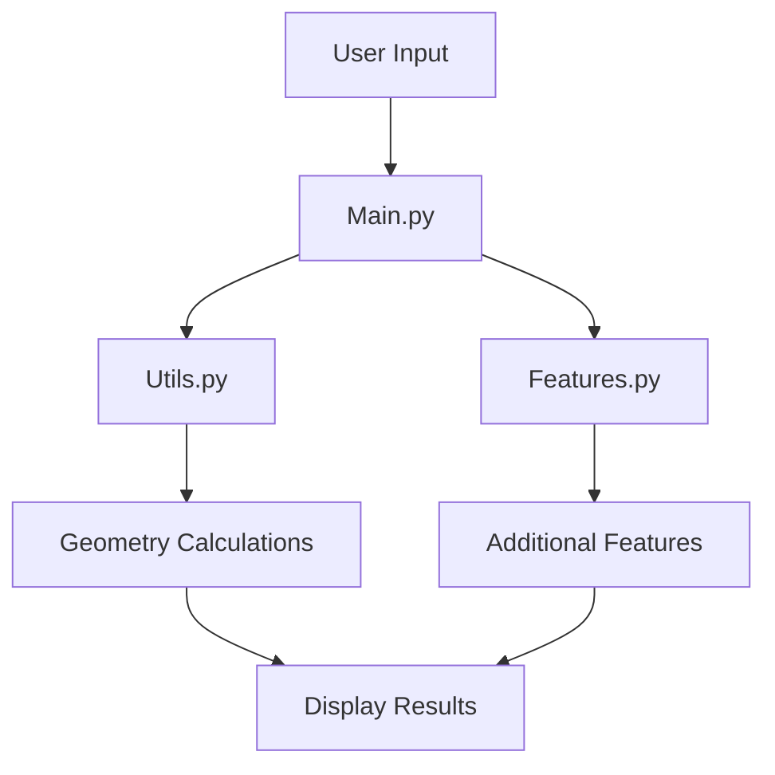

## Step 3: Debugging and Testing 🐞🔍

Ahoy, brave explorers of code! 🏴‍☠️ You've organized your kingdom and summoned your wizards. Now, it's time to ensure that your spells cast flawlessly! Debugging and testing are like a treasure hunt, where each clue brings you closer to a perfectly functioning program. Let's set sail on this adventure! 🧭

### The Treasure Map: Debugging Tips

Fear not, for every great coder has faced challenges. Here are some trusty tips to guide you through debugging:

- **Print Statements**: Use them like a flashlight in a dark cave to illuminate your program's flow.
- **Step-by-Step Execution**: Break down your program into small parts and test them independently.
- **Error Messages**: These are your pirate clues! Read them carefully as they often lead you directly to the issue at hand.

```python
# Example of debugging with print statements
print("Starting calculation...")
area = calculate_rectangle_area(10, 5)
print(f"Calculated area: {area}")
```

### Your Quest: Debug and Test the Code 🏴‍☠️

1. **Test Each Module**: Run the functions in each module to ensure they work as expected.
2. **Look for Bugs**: If something doesn't work, use print statements and check your logic.
3. **Celebrate Your Success**: Once your project runs smoothly, do a little victory dance! 🎉

### Flow of Integration: How Everything Fits Together 🌀

Let's visualize how your modules and features interact in your project:



### 🎉 Celebrate Your Coding Symphony!

Congratulations, Mathletes! You've successfully integrated your modules and features into a harmonious project. This is a significant milestone in your coding journey, and you should be proud of your accomplishments. Keep experimenting and continue to build upon your project.

In future lessons, we'll explore more advanced topics and enhance your project's capabilities even further. Until then, keep coding, stay curious, and most importantly, have fun! 🚀🔍

Happy coding, Mathletes! 🎈✨