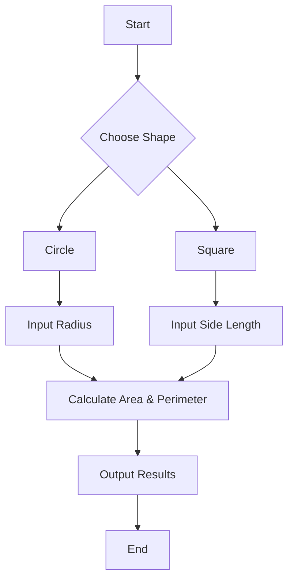

# Introduction to Mathletes: Python Geometry Adventure 2 🌟

## Welcome Mathletes! 🚀
Hey there, aspiring code wizards and math magicians! Welcome to the world of **Mathletes: Python Geometry Adventure 2!** Are you ready to explore the amazing universe where numbers, shapes, and Python programming collide? Buckle up, because this journey is going to be a blast! 🎉

## Lesson Overview 📚
In this lesson, we're going to dive into the exciting goals and learning outcomes of our adventure. You'll discover how mathematics and Python can work together to solve real-world problems. By the end of this journey, you'll be able to create your own Python programs to tackle mathematical challenges and even visualize them in cool ways! 😎

## What You Will Learn 🧠
- **Project Goals:** Understand the purpose of our Python Geometry Adventure and what exciting challenges await you.
- **Python & Math:** Learn how Python programming can help solve mathematical puzzles and problems.
- **Real-World Applications:** See how geometry and math can be applied to solve problems in the world around you.

## Lesson Key Concepts 🔑
- **Computational Geometry:** Using Python to solve geometric problems.
- **Algorithm Development:** Creating step-by-step instructions to solve math challenges.
- **Data Visualization:** Bringing mathematical data to life with visuals.

## Learning Objectives 🎯
- Understand the basics of geometry in Python programming.
- Write simple Python programs to solve geometric problems.
- Visualize data using Python libraries like Matplotlib.

## Let's Get Started! 💡
Imagine you're an explorer, just like Indiana Jones, but instead of searching for ancient artifacts, you're going on a quest to uncover the secrets of math using Python! 🏺💻

### Meet the Python
Python is a powerful programming language that's as friendly as a pet! 🐍 It's the perfect tool for kids and teens to learn programming concepts while having fun with math.

### Your First Challenge - Circles and Squares!
Let's start with something simple: **Circles** and **Squares**! What if you could calculate the area and perimeter of these shapes using Python?

#### Here's Your Code Snippet to Get Started:
```python
# Calculate the area and perimeter of a circle
import math

def circle_area(radius):
    return math.pi * (radius ** 2)

def circle_perimeter(radius):
    return 2 * math.pi * radius

# Calculate the area and perimeter of a square
def square_area(side):
    return side * side

def square_perimeter(side):
    return 4 * side

# Test your functions
print("Area of circle: ", circle_area(5))
print("Perimeter of circle: ", circle_perimeter(5))
print("Area of square: ", square_area(4))
print("Perimeter of square: ", square_perimeter(4))
```

### Visualizing with Mermaid
Here's a simple flowchart to understand the process of calculating areas:



## Wrap Up 🎩
Congratulations, Mathlete! You've taken your first step into the world of Python Geometry. Remember, every great coder started with a single line of code. Keep practicing, and soon you'll be solving math puzzles like a pro. Stay curious, and see you in the next lesson! 👋

---

## Additional Resources 📖
- [Python Documentation](https://docs.python.org/3/): Dive deeper into Python.
- [Matplotlib](https://matplotlib.org/): Explore more about visualizing data with Python.

---

Keep coding, Mathletes, and let your imagination lead the way! 🌟