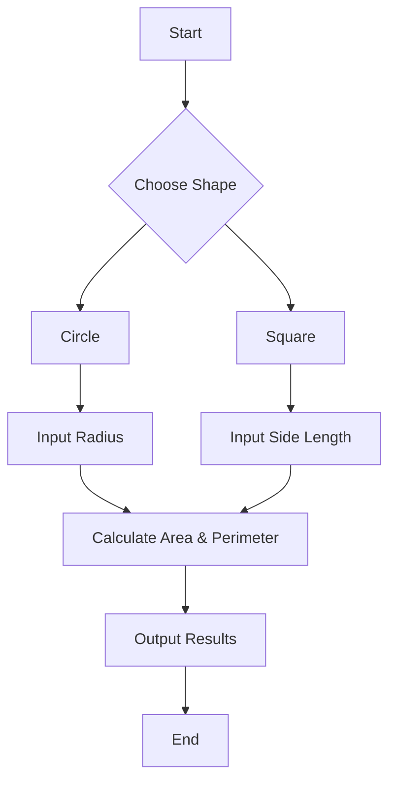

# Step 1: Adventure Awaits: The World of Shapes! 🌟

Hello, young adventurers! Are you ready to embark on a new quest in the land of Geometry with your powerful ally, Python? 🐍✨ Today, we’re putting on our explorer hats and diving into the magical world of shapes. Let’s get started on this exciting journey! 🚀

## Discover the Secrets of Shapes 🔍
In this first step, we're focusing on understanding the basic properties of two of the most fascinating shapes in geometry: **Circles** and **Squares**. These shapes are not just random; they have secrets and mysteries waiting for you to uncover! 🕵️‍♀️🕵️‍♂️

### The Mystery of the Circle ⚪️
Did you know that the circle is the most mysterious shape in geometry? It's perfectly round and has no beginning or end. To unlock its secrets, you need to know two magical words: **Area** and **Perimeter**. 

- **Area** is like the treasure hidden inside the circle. It’s the space enclosed within the boundary.
- **Perimeter**, also known as the circumference, is the path you take if you walk around the circle.

Here's how you can calculate these using Python:

```python
import math

def circle_area(radius):
    return math.pi * (radius ** 2)

def circle_perimeter(radius):
    return 2 * math.pi * radius
```

### The Secret of the Square 🔲
The square is a shape of order and symmetry. Every side is like a soldier, standing tall and equal.

- **Area** is what’s inside, just like with a circle.
- **Perimeter** is the path along its four equal sides.

Here's the code to reveal the square’s secrets:

```python
def square_area(side):
    return side * side

def square_perimeter(side):
    return 4 * side
```

## Interactive Challenge: Shape Explorer 🧩
Now it’s your turn, Mathlete! Create your own Python program using the code snippets above. Try changing the values of **radius** and **side** to see how the area and perimeter change. Can you predict the results before running the code? 🤔

### Flowchart: The Adventure Path
To help you visualize the journey, here’s a flowchart showing the steps to calculate the area and perimeter:



## Action Item: Try It Out! 🎮
1. **Run the code snippets**: Open your favorite Python editor and type in the code for circles and squares.
2. **Experiment**: Change the values of the radius and side length. Notice how the area and perimeter change with different inputs.
3. **Discuss**: Why do you think these changes happen? Share your thoughts with a friend or a fellow Mathlete!

## Reflect and Share 💬
Congratulations on unlocking the secrets of circles and squares! But remember, this is just the beginning. Every shape has a story, and every Mathlete has the power to discover it. Share your findings and thoughts with your class or in a group chat. What surprised you the most about these shapes?

See you in the next step of our adventure, where we’ll dive deeper into the realm of geometry with Python! Keep coding and exploring, Mathletes! 🌟