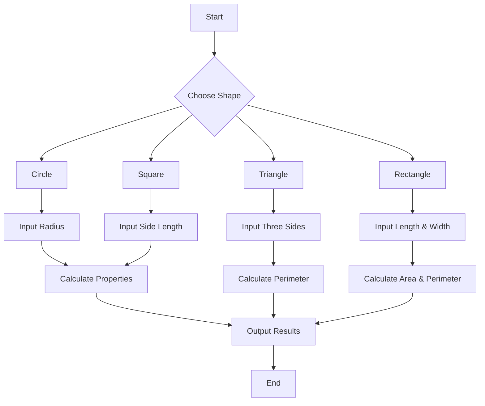

# Step 2: Dive Deeper into the Geometry Ocean! 🌊🐢

Ahoy, Mathletes! Ready to set sail on the geometry ocean? Today, we're diving deeper into our Python-powered adventure, exploring the hidden treasures of shapes and their secrets. Grab your snorkels, because it’s time to discover more about circles and squares and even meet some new shapes along the way! 🏄‍♂️🌟

## Unveiling More Secrets 🔮

In our last adventure, we unearthed the mysteries of circles and squares. But did you know there’s more to these shapes than just area and perimeter? Let's dig deeper:

### The Circle’s Hidden Power 🔵

Circles aren’t just about area and perimeter; they have other magical properties too:

- **Diameter**: It's like the circle’s backbone, stretching from one side to the other through the center.
- **Radius**: Half of the diameter, it’s the circle’s secret ingredient that helps calculate many other properties.

Here's how you can calculate these using Python:

```python
# Calculate the diameter of a circle
def circle_diameter(radius):
    return 2 * radius

# Calculate the radius if you know the diameter
def radius_from_diameter(diameter):
    return diameter / 2

# Test the functions
print("Diameter of circle: ", circle_diameter(5))
print("Radius from diameter: ", radius_from_diameter(10))
```

### The Square’s Strength 💪

Squares hold secrets of their own. A square’s simplicity gives it strength:

- **Diagonal**: The secret line that cuts through the square, connecting opposite corners.

Here’s how to uncover the diagonal:

```python
# Calculate the diagonal of a square
def square_diagonal(side):
    return side * math.sqrt(2)

# Test the function
print("Diagonal of square: ", square_diagonal(4))
```

## Meet New Friends: Triangles and Rectangles 🔺🔷

Our journey doesn’t stop at circles and squares. Let’s welcome triangles and rectangles to our adventure!

### The Trusty Triangle 🔺

Triangles are everywhere, from the roofs of houses to pizza slices! Their power lies in their three sides and angles.

#### Types of Triangles
- **Equilateral**: All sides and angles are equal.
- **Isosceles**: Two sides and two angles are equal.
- **Scalene**: All sides and angles are different.

Here’s a snippet to calculate the perimeter of a triangle:

```python
# Calculate the perimeter of a triangle
def triangle_perimeter(side1, side2, side3):
    return side1 + side2 + side3

# Test the function
print("Perimeter of triangle: ", triangle_perimeter(3, 4, 5))
```

### The Reliable Rectangle 🔷

Rectangles are like stretched squares. They’re used in everything from windows to playing fields.

#### Calculate the Area and Perimeter

```python
# Calculate the area and perimeter of a rectangle
def rectangle_area(length, width):
    return length * width

def rectangle_perimeter(length, width):
    return 2 * (length + width)

# Test the functions
print("Area of rectangle: ", rectangle_area(5, 3))
print("Perimeter of rectangle: ", rectangle_perimeter(5, 3))
```

## Interactive Challenge: Shape Shifter 🧙‍♂️

It’s your turn, Mathlete! Use the code snippets to explore the hidden powers of these shapes. Try different values and predict the outcomes. What happens if you change the sides of a triangle or the dimensions of a rectangle? 🤔

### Flowchart: The Great Shape Map
Here’s a flowchart to guide you through these calculations:



## Action Item: Shape Mastery 🎯
1. **Try the code snippets**: Open your Python editor and test out the new functions.
2. **Explore and Experiment**: Modify the dimensions of each shape and observe the results.
3. **Share and Discuss**: Talk about your findings with friends. What new insights did you discover about these shapes?

## Reflect and Share 💭
Awesome job, Mathletes! You’ve navigated through the ocean of geometry, uncovering the mysteries of circles, squares, triangles, and rectangles. Share your journey with classmates or in a group chat. What was the most exciting part of this adventure?

Prepare for the next leg of our journey, where we’ll explore even more complex shapes and concepts with Python! Keep exploring and coding, Mathletes! 🌟