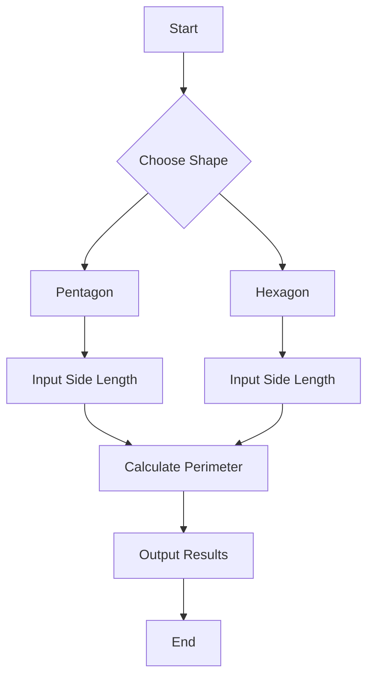

# Step 3: The Geometry Adventure Continues! 🚀🌈

Hello again, intrepid Mathletes! Are you ready to level up your geometry skills and become a master of shapes? Today, we'll wrap up our exploration of basic shapes and set the stage for even more exciting adventures. Let's dive right in! 🌊🐠

## Unlocking the Secrets of More Shapes 🔑

So far, we've explored circles, squares, triangles, and rectangles. But the world of geometry is vast, and there are more shapes waiting for us to discover their secrets!

### The Mysterious Pentagon 🔺🔻

The pentagon is a five-sided shape that often reminds us of stars. You might see it in nature, architecture, and art. Let's uncover its mysteries:

- **Perimeter**: The total length around the pentagon.
- **Area**: The space inside its five sides.

Here's how you can calculate the perimeter of a regular pentagon (where all sides are equal):

```python
# Calculate the perimeter of a regular pentagon
def pentagon_perimeter(side):
    return 5 * side

# Test the function
print("Perimeter of pentagon: ", pentagon_perimeter(6))
```

### The Hexagon’s Harmony 🔷🔶

Hexagons are found in honeycombs and are known for their efficiency and beauty. With six equal sides, they form a perfect harmony.

- **Perimeter**: The sum of all six sides.

Here's how you can calculate it:

```python
# Calculate the perimeter of a regular hexagon
def hexagon_perimeter(side):
    return 6 * side

# Test the function
print("Perimeter of hexagon: ", hexagon_perimeter(4))
```

## Interactive Challenge: Shape Detective 🕵️‍♀️🕵️‍♂️

Now it’s your turn to be a shape detective! Use the code snippets to explore these new shapes. Try different side lengths to see how the perimeter changes. Can you predict the results before running the code? 🤔

### Flowchart: The Shape Explorer
Here’s a flowchart to guide your exploration and calculations:



## Action Item: The Shape Challenge 🎮
1. **Experiment with Code**: Open your Python editor and try out the code snippets for pentagons and hexagons.
2. **Predict and Explore**: Change the side lengths and predict the perimeter.
3. **Reflect**: What do you notice about these shapes? How do they compare to the ones you've studied before?

## Reflect and Share 💬
Congratulations, Mathletes! You've expanded your geometry knowledge and uncovered the secrets of new shapes. Share your discoveries with your classmates or in a group chat. What was your favorite shape to explore and why?

Prepare for our next adventure, where we'll delve into more complex shapes and learn how to visualize them with Python. Keep exploring and coding, Mathletes! 🌟

---

## Bonus Challenge 🌟
Can you create a Python function to calculate the area of a regular pentagon or hexagon using trigonometry? Research the formulas and give it a try! Share your code with your teacher or fellow Mathletes and see who can come up with the most creative solution.

---

Stay curious and keep coding, Mathletes! Your journey through the world of geometry is just beginning. 🚀