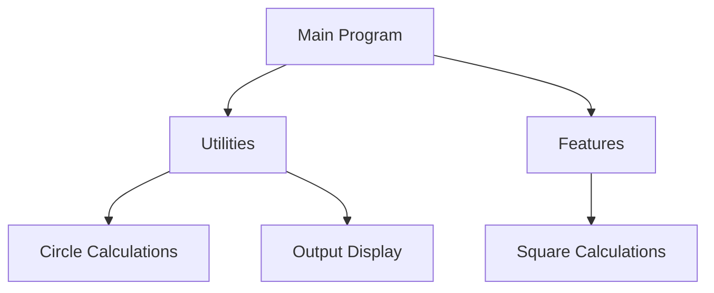

# Lesson Title: Reviewing Design Documents 📚

## Lesson Overview
Welcome, Mathletes! Today, we're putting on our detective hats 🕵️‍♀️🕵️‍♂️ and diving into the world of design documents. These documents are like treasure maps, showing us how our Python project is structured and guiding us through the adventure of coding. By the end of this lesson, you'll be a pro at understanding the project’s blueprint, including pseudocode and architecture. Ready to uncover the secrets? Let's go! 🚀

## What You Will Learn 🧠
- **Understanding Design Documents**: Learn how to read and interpret design documents to get a clear view of your project.
- **Pseudocode Wizardry**: Discover how pseudocode helps you plan your code before you start typing.
- **Architectural Overview**: Gain insights into how different parts of your project fit together like pieces of a puzzle.

## Lesson Key Concepts 🔑
- **Design Documents**: Detailed guides that outline the structure and flow of a project.
- **Pseudocode**: Simplified code written in plain language to help plan your program.
- **Project Architecture**: The organization and interaction of different components within your project.

## Lesson Learning Objectives 🎯
- Identify and understand the components of a design document.
- Write simple pseudocode to outline a solution.
- Recognize the architecture of a Python project and its components.

---

## Let's Dive In! 🌊

### What Are Design Documents? 📜
Design documents are like the blueprints of a building for your project. They tell you what your project will do and how it will be built. They include details about the different parts of the project, how they interact, and even some code-like instructions called pseudocode.

### The Role of Pseudocode 📝
Pseudocode is like writing a recipe for your code. It’s not actual Python code, but it helps you plan what your code will do. It’s written in plain English, so it’s easy to understand.

### Understanding Project Architecture 🏗️
The architecture of a project is how different pieces fit together, like a jigsaw puzzle. This includes understanding how your main program interacts with utilities and features. 

---

## Example: Exploring Pseudocode and Architecture

### Pseudocode Example
Let's imagine you are writing a program to calculate the area of a circle:

```plaintext
1. Start
2. Input radius of the circle
3. Compute area using the formula: area = π * radius * radius
4. Output the area
5. End
```

### Architecture Diagram
Here's a simple architecture diagram to help you visualize the components of our "Mathletes: Python Geometry Adventure 2" project.



## Interactive Activity: Design Your Own Pseudocode 🧩
Now it's your turn! Think about a simple task, like making a sandwich, and write a pseudocode for that task. For example:

```plaintext
1. Start
2. Take two slices of bread
3. Spread peanut butter on one slice
4. Spread jelly on the other slice
5. Put the two slices together
6. Eat the sandwich
7. End
```

Share your pseudocode with a friend and see if they can follow it! 🤝

## Wrap Up 🎉
You've done a fantastic job exploring design documents, pseudocode, and project architecture. Remember, these are the tools that will help you build amazing Python projects. Keep practicing, and you'll be coding like a pro in no time!

---

## Additional Resources 📖
- [Python Pseudocode Guide](https://example.com/pseudocode-guide): Learn more about writing effective pseudocode.
- [Understanding Project Architecture](https://example.com/project-architecture): A guide to understanding how project components interact.

---

Keep exploring, Mathletes, and let your imagination guide your coding journey! 🌟