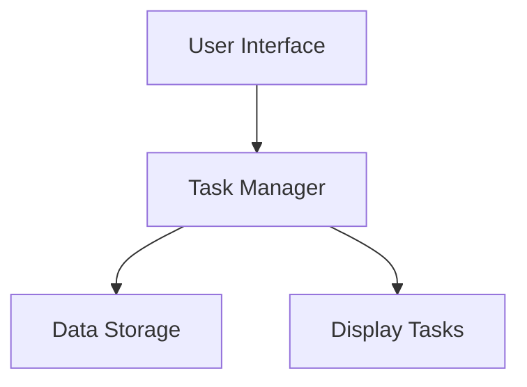

# Lesson Step 3: Unlocking the Secrets of Project Architecture 🏗️✨

Greetings, Mathlete Architects! Are you ready to build on the knowledge you’ve gained? Today, we're transforming into architects and exploring the grand design of project architecture. Just like how a building stands on a solid foundation, your Python projects rely on a well-structured architecture. Let’s dive into the blueprint! 🏢

## Mission Objective 🕵️‍♀️🕵️‍♂️

### Step 3: Constructing Your Project Blueprint 🏛️🔍

Project architecture is the backbone of your coding adventures. It’s how all the pieces come together to form a cohesive whole. Your mission today is to understand and create a basic architectural plan for a Python project.

### Interactive Construction: Building the Structure 🏗️🛠️

1. **Understand the Components**: Just like a building has floors and rooms, a project has components like modules, functions, and libraries. Let’s explore a simple project setup.

2. **Visualize the Framework**: Here’s a **Mermaid** diagram of a simple project architecture:

   ```mermaid
   graph TD;
       A[Main Application] --> B[User Interface];
       A --> C[Backend Processing];
       C --> D[Database Management];
       C --> E[APIs & Services];
       B --> F[User Inputs];
   ```

3. **Design Your Own**: Think of a simple project idea, like a "Math Helper" app, and sketch its architecture. What components do you need? How do they interact?

### Architectural Challenge: Create Your Own Project Blueprint 🧩📜

Your challenge is to design a basic architecture for a program that manages a to-do list. Use plain language to outline the major components and their interactions.

Example:

```plaintext
## Project Name: To-Do List Manager
### Components:
- User Interface: Allows users to add, view, and remove tasks.
- Task Manager: Handles the logic of adding and removing tasks.
- Data Storage: Saves the list of tasks.
### Interaction:
- User enters tasks through User Interface.
- Task Manager updates the task list.
- Data Storage keeps tasks saved.
```

## Bonus: Understanding the Flow with a Diagram 🎨📝

To visualize your "To-Do List Manager," here’s how it might look in a flow diagram:



## Wrap-Up for Step 3 🎉

Bravo, Mathletes! You've built a strong foundation in understanding project architecture. Whether you’re designing a small app or a grand software system, remember that a solid architecture is key to success. Keep practicing, and soon you'll be constructing intricate projects with ease! 🏗️✨

Stay curious, keep building, and let your creativity soar as you continue your coding journey! 🚀🌟

---

## Additional Resources 📚
- [Introduction to Software Architecture](https://example.com/software-architecture): Learn more about creating effective software architectures.
- [Python Project Structure Guide](https://example.com/python-project-structure): A beginner's guide to structuring Python projects effectively.

---

Keep designing, Mathletes, and continue to let your imagination shape your code! 🌟