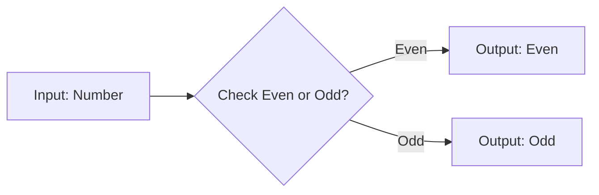

# Lesson 3: Foundational Python Concepts 🔍🐍  

## Step 1: Unleashing the Power of Functions! 🌟🔧  

Hello, Mathletes! 🎉 Today, we're going to dive deeper into the magical world of **functions** in Python! Functions are like your personal wizards in the coding realm—they help you perform tasks with just a flick of your wand... well, code! 🧙‍♂️✨

### What Are Functions?  
Functions are blocks of code that you can use over and over again, just like how you might reuse a favorite recipe to bake cookies. 🍪 Imagine you have the best cookie recipe, and any time you want cookies, you just follow the steps and voilà—cookies! That's what functions do for your code.

### Let's Explore Functions with a Fun Activity! 🎨🖌️  
We're going to create a function that tells us if a number is even or odd. This is like having a tiny helper that checks numbers for you while you do something else—like eat cookies! 🍪

```python
# Function to check if a number is even or odd

def check_even_odd(number):
    if number % 2 == 0:
        print(f"{number} is even.")
    else:
        print(f"{number} is odd.")

# Try it out with an example!
check_even_odd(7)
check_even_odd(10)
```

### Interactive Challenge: Create Your Own Number Checker! 🧠💡  
Now it's your turn! Create a function that takes a number as input and tells if it's **positive** or **negative**. Here's a little template to get you started:

```python
# Function to check if a number is positive or negative
def check_positive_negative(number):
    # Your code here!

# Test your function with different numbers
check_positive_negative(15)
check_positive_negative(-8)
```

### Visualize the Magic! 🌈✨  
Functions are like machines that take input, process it, and give you some output. Here's a simple flowchart to visualize what happens inside a function:



### Fun Fact: Functions Everywhere! 🌎🔍  
Did you know that functions are everywhere in technology? From apps on your phone to the websites you visit—functions are working behind the scenes to make everything run smoothly! They are like the secret superheroes of the coding world. 🦸‍♀️🦸‍♂️

---

You've taken your first step into mastering Python functions! Keep experimenting and creating your own functions. They will be your trusty sidekicks in any coding adventure you embark upon. 🚀

### Next Up: Get ready to dance with Loops! 🔄💃🕺  
In our next step, we'll explore loops and see how they can make your code dance to the rhythm of repetition. Stay tuned! 🎶