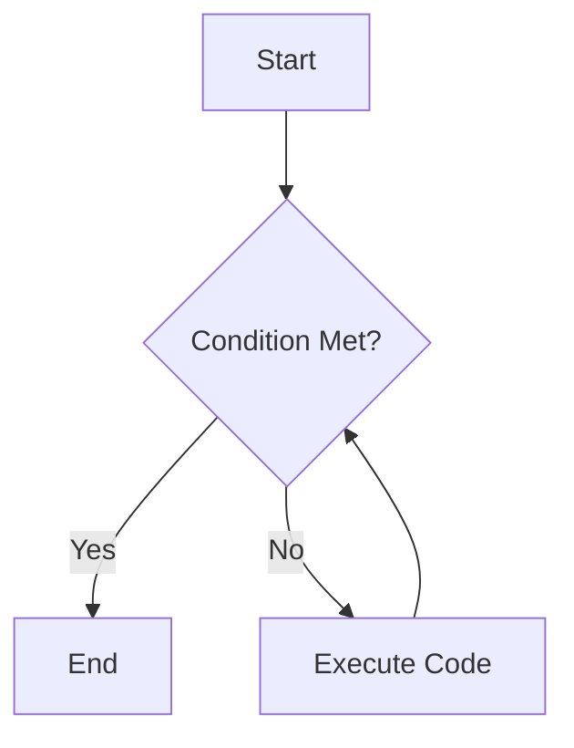

## Step 2: Let's Groove with Loops! 🔄💃🕺  

Hey there, Mathletes! 🌟 Now that we've got our wizardly functions down, it's time to get into the groove with **loops**. Loops are like the rhythm section of your favorite song, keeping everything moving in time and on beat. 🥁🎵

### What Are Loops?  
Loops are constructs that let you repeat a set of instructions multiple times. Imagine you're jumping rope, and each turn of the rope is a cycle—loops let you keep jumping until you decide to stop! 🏃‍♂️⏳

### Let's Loop with a Fun Activity! 🎨🔄  
We're going to create a loop that counts from 1 to 5, just like counting the steps in a dance move. Ready to moonwalk through some code? Let's go! 🌕🚶‍♂️

```python
# Loop to count from 1 to 5

for number in range(1, 6):
    print(f"Step {number}: Keep on dancing!")
```

### Interactive Challenge: Create a Countdown Timer! ⏲️🔢  
It's your turn to shine! Create a loop that counts down from 10 to 1 and then prints "Blast off!"—just like a rocket launch countdown. Here's a little nudge to get you started:

```python
# Countdown from 10 to 1
for number in range(10, 0, -1):
    print(number)
print("Blast off!")
```

### Visualize the Groove! 🎶✨  
Loops can be visualized as a cycle that repeats until a condition is met, like a merry-go-round that spins until you're dizzy! 🎠 Here's a simple flowchart to help you see the loop's flow:



### Fun Fact: Loops in Nature! 🌍🔄  
Did you know that loops are a natural part of our world? 🌿 Think of the seasons changing, the water cycle, or even the daily sunrise and sunset. They all repeat in a loop, just like in our code! 🌞🌜

---

You've just danced your way through Python loops! Keep practicing and see how you can make your code dance in endless patterns. 🎉

### Next Up: Mastering Data with Structures! 📚📊  
In our next step, we'll dive into data structures and see how they help us organize information in our programs. Ready to build your knowledge skyscraper? Stay tuned! 🏗️🚀