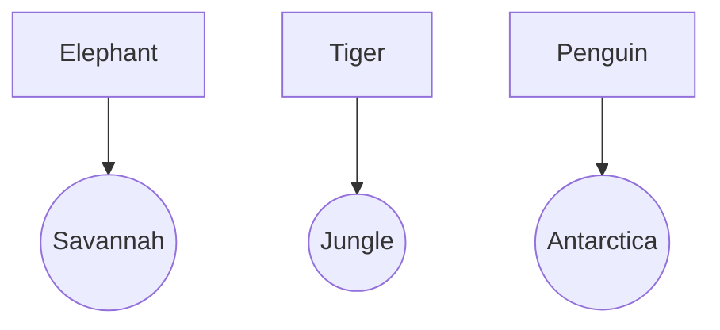

## Step 3: Building with Data Structures! 📚🛠️  

Hello again, Mathletes! 🌟 Now that we've mastered the magical functions and groovy loops, it's time to construct something amazing with **data structures**. These are like your Lego bricks that help you build complex and organized creations in code! 🏗️🧱

### What Are Data Structures?  
Data structures are ways to store and organize data in your programs, allowing you to manage and manipulate your information with ease. Imagine you have a treasure chest 🏴‍☠️ filled with different gems (data) — data structures help you sort, find, and use these gems efficiently!

### Let's Explore Lists and Dictionaries! 📋📖  

#### Lists: Your Treasure Map of Data 🗺️  
A **list** is like a collection of items you can organize in a specific order. It's like having a playlist of your favorite songs where you can easily add, remove, or find a song! 🎶

```python
# A list of favorite fruits
fruits = ["apple", "banana", "cherry"]
print(fruits[1])  # Output: banana
```

#### Dictionaries: Your Secret Code Book 🔐  
A **dictionary** is like a real-life dictionary where you look up words to find their meanings. In coding, a dictionary pairs **keys** with **values** — like names and phone numbers in a contact list! 📞

```python
# A dictionary of student grades
grades = {"Alice": "A", "Bob": "B", "Charlie": "A+"}
print(grades["Charlie"])  # Output: A+
```

### Interactive Challenge: Organize Your Own Data! 🏗️🔍  
Create a list of your favorite animals and a dictionary mapping those animals to their habitats. Here's a spark to light your creative coding fire:

```python
# List of favorite animals
animals = ["elephant", "tiger", "penguin"]

# Dictionary of habitats
habitats = {"elephant": "savannah", "tiger": "jungle", "penguin": "Antarctica"}

# Print your favorite animal's habitat
print(f"The habitat of the tiger is: {habitats['tiger']}")
```

### Visualize Your Data Structures! 🖼️✨  
Think of lists as a sequence of numbered boxes, each holding a valuable item, while dictionaries are like a collection of labeled lockers, each containing a specific treasure. 🎁



### Fun Fact: Data Structures in Action! 🌐🔍  
Did you know that every time you search for a video on your favorite streaming service, data structures are at work? They help organize and retrieve all those videos quickly so you can enjoy your show! 📺

---

You've just built a solid foundation with Python's data structures! Keep experimenting and see how these structures can help you organize everything from simple lists to complex databases. You're on your way to becoming a coding architect! 🚀

### Ready for More Adventures? 🌟🔎  
In our upcoming lessons, we'll discover how these powerful tools come together to solve real-world problems. Keep practicing, and remember: with each line of code, you're building the future! 🌈💻