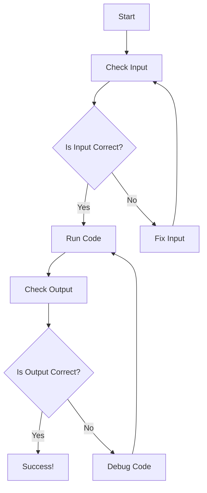

# Lesson 7: Testing and Debugging 🐞🚀

Welcome, young Mathletes, to another exciting adventure in our Python Geometry Adventure! Today, we're going to become code detectives as we learn about **Testing and Debugging**. Our mission is to ensure that all our Python programs run perfectly without any hiccups!

---

## Lesson Overview 🌟

In this lesson, we’ll explore how to test our code and fix any pesky bugs that might pop up. You'll be learning techniques to make sure your Python code is as smooth as a well-oiled machine. By the end of this lesson, you'll be a debugging superhero! 🦸‍♂️🦸‍♀️

## Lesson Objectives 🎯

- Understand the importance of testing and debugging.
- Learn basic testing methodologies.
- Master debugging techniques to identify and fix errors.
- Apply these skills to ensure your geometry project works perfectly.

## What is Testing? 🔍
Testing is like taking your code out for a test drive 🚗 to make sure everything works as expected. Just like you'd check if a car's brakes work before hitting the road, we need to check our code for errors.

### Why Test?
- **Catch Errors Early:** Find mistakes before they cause problems.
- **Improve Code Quality:** Ensure your code is reliable and does what it's supposed to do.
- **Save Time:** Fixing problems early saves time in the long run.

## Basic Testing Methodologies 🧪

Here are some simple ways you can test your Python code:

1. **Print Statements:**
   - Use `print()` to display the values of variables and check if they are as expected.
   - Example:
     ```python
     result = calculate_area(5)
     print("The area is:", result)  # Check if the result is correct
     ```

2. **Assertions:**
   - Use assertions to check if a condition is true. If not, Python will raise an error.
   - Example:
     ```python
     assert calculate_area(5) == 25, "The area should be 25 for a side of 5!"
     ```

## Debugging Techniques 🔧

Even the best coders encounter bugs, but fear not! Debugging is like solving a fun puzzle 🧩. Here’s how you can become a debugging pro:

1. **Read Error Messages:**
   - Python will often tell you what's wrong. Read the error messages carefully.

2. **Check Your Logic:**
   - Go through your code line by line to ensure your logic is sound.

3. **Use a Debugger:**
   - Tools like Python's built-in debugger (pdb) can help you step through your code.

## Fun Debugging Exercise 🎲

Let's try debugging a simple piece of code together. Can you spot the mistake?

```python
# This code is supposed to calculate the perimeter of a square
def calculate_perimeter(side_length):
    perimeter = side_length * 3  # Oops! Can you find the error?
    return perimeter

print("The perimeter is:", calculate_perimeter(4))  # Should be 16
```

### Solution:
The mistake is in the multiplication. It should be `side_length * 4` since a square has four sides. Debugging success! 🎉

## Visual Debugging with Diagrams 🖼️

Let's see how a flow diagram can help us debug:



## Conclusion 🎉

Testing and debugging are critical skills in programming. They ensure your code is correct and reliable, just like a superhero always ready to save the day! Keep practicing these skills, and soon you'll be solving complex coding challenges with ease.

Ready to test your skills? Try creating your own test cases and debug any bugs you find. Remember, every bug you fix makes you a better programmer! 🌟

---

Keep coding and stay curious, Mathletes! 🤓💻