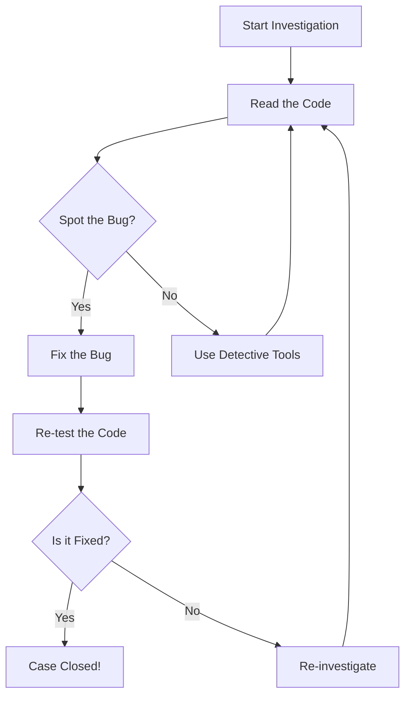

# Step 1: Become a Code Detective 🕵️‍♂️🕵️‍♀️

Hello, Mathlete! Today, you're not just a coder; you're a detective on a mission to uncover mysteries in your code! 🕵️‍♂️ Let's dive into the world of **Testing and Debugging** with an exciting interactive activity! 

## Your Mission: Code Detective Challenge 🕵️‍♀️🔍

Every great detective needs a case to solve, and today, your case involves a mysterious bug lurking in the code. But don't worry, you have all the tools you need to crack the case! Let's get started!

### Case File: The Missing Square Perimeter 🗂️

Here's a snippet of code that's supposed to calculate the perimeter of a square, but something's not right. Can you find the bug and fix it?

```python
# Detective Challenge: Find the bug in this code

def calculate_perimeter(side_length):
    # The perimeter calculation seems a bit off 🤔
    perimeter = side_length * 3  # Is this correct for a square?
    return perimeter

# Test the function with a side length of 4
print("The perimeter is:", calculate_perimeter(4))  # Should be 16
```

### Detective Tools 🛠️

Before you start, let's review some detective tools to help you:

1. **Print Statements:** Use print statements to check variable values and understand the flow of your program. 
   - Example:
     ```python
     print("Side length is:", side_length)
     print("Calculated perimeter is:", perimeter)
     ```

2. **Assertions:** Use assertions to verify that your code is doing what you expect it to do.
   - Example:
     ```python
     assert calculate_perimeter(4) == 16, "Expected perimeter to be 16!"
     ```

### Detective Badge 🏅

Once you find and fix the bug, you'll earn your **Detective Badge**! Every bug you solve is a step toward becoming a coding superhero!

### Visualize the Detective Process 🖼️

Here's how the detective process works, visualized in a flow diagram:



## Ready, Set, Investigate! 🚀

Are you ready to solve the mystery and earn your Detective Badge? Dive into the code, use your detective tools, and fix the bug! Remember, every bug is a little mystery waiting to be solved, and you're the hero to solve it! 🌟

---

Keep exploring and debugging, and remember to have fun along the way! You're doing amazing, Mathlete! 🤓💻