# Step 2: Master the Art of Debugging 🧙‍♂️✨

Welcome back, Code Detective! 🚀 Now that you've had a taste of debugging, it's time to master this magical art. In this step, we're going to dive deeper into the world of debugging and equip you with more powerful tools and techniques!

## Debugging Tools and Techniques 🔧🛠️

Just like a wizard has a wand, a detective has tools to solve any mystery! Let's explore some advanced debugging tools:

1. **Breakpoints**: 
   - Think of breakpoints as magical pause buttons. They allow you to stop your code at a specific line and examine what's happening.
   - How to use:
     - In many code editors, you can set a breakpoint by clicking next to the line number. Run your code, and it will pause at the breakpoint.

2. **Step-by-Step Execution**:
   - Walk through your code one line at a time. This is like reading a detective novel page by page to ensure every detail is correct.
   - How to use:
     - Once your code is paused at a breakpoint, use step buttons to move through your code.

3. **Inspect Variables**:
   - Check the values of your variables while your code is paused. It's like checking your map while on a treasure hunt!
   - How to use:
     - Hover over variables or use the debug console to see their current values.

## Interactive Debugging Adventure 🌍🕵️‍♂️

Let's embark on an interactive adventure to put these tools to the test!

### Adventure: The Case of the Broken Calculator ⚖️

Join Detective Python on an adventure to fix a broken calculator program. Here’s the mysterious code:

```python
# Adventure Challenge: Fix the Calculator

def broken_calculator(x, y):
    result = x * y + 10  # The calculation seems fishy 🤔
    return result

# Test the calculator
print("The result is:", broken_calculator(5, 3))  # Should be 15
```

### Your Task:
- **Set Breakpoints**: Pause the code at the calculation line.
- **Step Through**: Execute the code step by step.
- **Inspect Variables**: Check the values of `x`, `y`, and `result`.
- **Fix the Bug**: Adjust the calculation so it works correctly.

### Diagram of the Debugging Adventure 🖼️

```mermaid
graph TD;
    A[Start Debugging] --> B[Set Breakpoints]
    B --> C[Run Program]
    C --> D{Pause at Breakpoint}
    D -- Inspect --> E[Check Variables]
    D -- Step Through --> F[Execute Next Line]
    E --> G{Is the Bug Found?}
    F --> G
    G -- Yes --> H[Fix the Code!]
    G -- No --> D
    H --> I[Test Again]
    I --> J{Is it Working?}
    J -- Yes --> K[Success! Case Solved 🎉]
    J -- No --> D
```


## Debugging Tips and Tricks 🧐💡

- **Stay Calm**: Even if bugs are tricky, remember every detective needs patience.
- **Talk It Out**: Explain your code to a friend or even a rubber duck. Sometimes saying it out loud helps!
- **Take Breaks**: Step away from your code and return with fresh eyes.

## Reflect and Celebrate 🌟🎈

Congratulations, young detective! You’ve learned how to use powerful debugging tools and solved a challenging mystery. Remember, every bug you solve is a step closer to becoming a master coder. Celebrate your success and keep practicing your skills!

---

Keep coding, keep debugging, and continue your exciting journey into the world of Python! You're doing great, Mathlete! 🤓💻