# Step 3: Level Up Your Coding Skills 🚀✨

Welcome back, Mathlete! You’ve journeyed far on the path of mastering the art of testing and debugging. Now, it's time to level up and become a **Coding Champion**! 🏆 Let's bring all your new skills together in a grand finale challenge!

## The Final Challenge: Geometry Genius 🧠🔍

Your ultimate mission is to apply everything you've learned to create a flawless Python program. You'll build a program that calculates both the perimeter and area of a square, and you'll ensure it's free from bugs! Ready to accept the challenge? Let’s go!

### Challenge Code 🏗️

Below is a starter code snippet. Your task is to complete it, test it, and debug any errors:

```python
# Challenge: Complete the Geometry Genius Program

def calculate_square_properties(side_length):
    # Calculate perimeter (make sure this is correct!)
    perimeter = side_length * 4
    
    # Calculate area (do you remember the formula?)
    area = side_length ** 2

    return perimeter, area

# Test the function
def test_calculate_square_properties():
    p, a = calculate_square_properties(5)
    assert p == 20, f"Expected perimeter to be 20, but got {p}"
    assert a == 25, f"Expected area to be 25, but got {a}"
    print("All tests passed! 🎉")

# Run the tests
test_calculate_square_properties()
```

### Steps to Success 🌟

1. **Understand the Task**: You need to ensure the function calculates both the perimeter and area of a square correctly.
2. **Write Tests**: Use assertions to test different side lengths and verify your program works correctly.
3. **Debug**: If any test fails, use your debugging skills to find and fix the issue.
4. **Celebrate Your Victory**: Once all tests pass, you've successfully completed the challenge!

### Visualization of the Process 🖼️

Here's a flow diagram to visualize your path to success:

```mermaid
graph TD;
    A[Start Challenge] --> B[Understand the Task]
    B --> C[Write Tests]
    C --> D{Do Tests Pass?}
    D -- Yes --> E[Celebrate 🥳]
    D -- No --> F[Debug the Code]
    F --> C
```



## Bonus Activity: Code Review Buddy System 🤝

Pair up with a buddy and review each other's code. Use this checklist to make sure everything is perfect:

- [ ] Are all calculations correct?
- [ ] Do all tests pass?
- [ ] Is the code clean and easy to read?

Discuss any improvements and learn from each other’s insights. After all, even superheroes work better in teams! 🦸‍♂️🦸‍♀️

## Conclusion 🎊

Congratulations on completing this adventure in testing and debugging! You’ve learned how to identify bugs, use powerful debugging tools, and write tests to ensure your code works like a charm. Keep practicing these skills, and you'll continue to grow as a programmer. Remember, every bug you conquer is a step towards becoming a coding legend!

Stay curious, keep coding, and never stop learning! You're amazing, Mathlete! 🤓💻

---

Ready for the next adventure? Keep exploring the world of Python and see where your newfound skills will take you! 🌍🚀