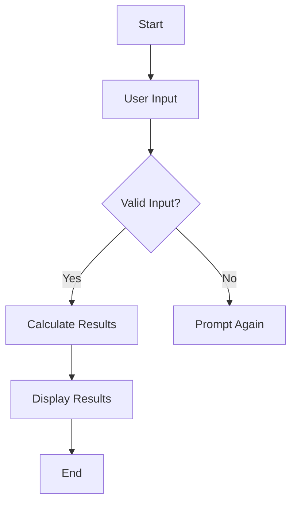

# Lesson 8: Enhancing the Project ✨🚀

Welcome back, brilliant Mathletes! 🌟 Today, we're going to sprinkle some magic dust on our Python Geometry Adventure project and make it truly shine! Are you ready to enhance and optimize your code like a pro? Let's dive in! 🏊‍♂️

---

## Lesson Overview 🌟

In this lesson, you’ll learn how to enhance your Python project by adding cool features and optimizing it for better performance. By the end of this lesson, your project will not only work well but will also stand out with its unique flair! 🎨

## Lesson Objectives 🎯

- Understand how to enhance your project with new features.
- Learn techniques to optimize your code for better performance.
- Apply creative thinking to make your project unique and engaging.
- Improve user experience and interface.

## Let's Make It Shine! ✨

### Step 1: Add a Splash of Color 🎨

Adding color to your project can make it visually appealing and fun to interact with! Let's use a simple Python library called `colorama` to add some color to our terminal outputs.

```bash
pip install colorama
```

Here's how you can use `colorama` to color your text:

```python
from colorama import Fore, Style

print(Fore.GREEN + "Success! You've completed the task!" + Style.RESET_ALL)
```

### Step 2: Make It Interactive 🎮

Interactive elements make your project more engaging. Let's add a simple input feature where users can input the side length of a square, and our program will calculate its perimeter and area.

```python
def calculate_square_properties():
    side_length = float(input("Enter the side length of the square: "))
    perimeter = side_length * 4
    area = side_length ** 2
    print(f"Perimeter: {perimeter}, Area: {area}")

calculate_square_properties()
```

### Step 3: Optimize for Speed 🏃‍♂️💨

Let's make sure our code runs as quickly as possible. Here are some tips:

1. **Avoid Repetition:** If you find yourself writing the same code multiple times, put it in a function!
2. **Use Efficient Algorithms:** Use built-in Python functions and libraries—they're optimized for performance.
3. **Profile Your Code:** Use Python's `cProfile` to see where your code spends the most time and improve it.

### Step 4: Add User-Friendly Messages 😊

Enhance your program by adding friendly messages that guide the user through your code. This makes your project more accessible and enjoyable.

```python
def user_greeting():
    print("Welcome to the Geometry Adventure! Let's explore some cool math together! 🎉")

user_greeting()
```

### Visualization with Diagrams 📊

Let's visualize the flow of user interaction with a simple diagram:



## Conclusion 🎉

Congratulations, Mathletes! You've learned how to enhance and optimize your Python project, making it both functional and fabulous! Keep experimenting and adding your unique touch to make your project truly yours. Remember, creativity is your superpower! 🦸‍♂️🦸‍♀️

Ready to show off your enhanced project? Share it with your friends and family and let them marvel at your coding skills! Keep shining, and stay curious, Mathletes! 🤓💻

---

Continue building, exploring, and most importantly, having fun with Python! You're doing amazing! 🌟🚀