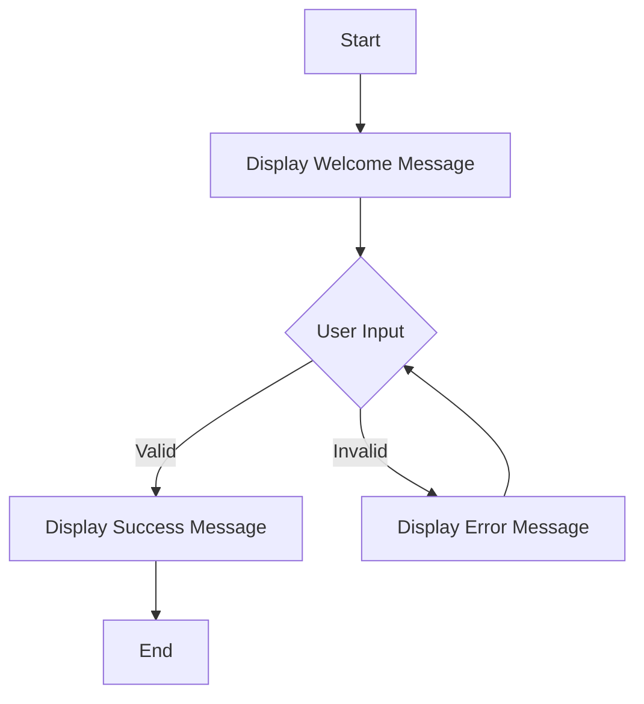

# Step 1: Add a Splash of Color 🎨🌈

Hey there, creative coders! 🌟 Are you ready to add some pizzazz and make your Python project pop with color? 🤩 Today, we'll learn how to make our terminal outputs as vibrant as a rainbow! 🌈 Let's make our Geometry Adventure not only smart but also stylish!

## Why Use Color? 🤔

Imagine reading a book with no illustrations or colors. Pretty dull, right? Adding color to your project is like adding sprinkles to a cupcake—it's more fun, and you can easily highlight important information! 🍰✨

Here’s the plan:
- **Highlight Success Messages**: Let your users know when they've done a great job! 🏆
- **Differentiate Between Outputs**: Use color to distinguish between different types of information, like results and errors.
- **Make It FUN!**: Everyone loves colorful things, and your project will be no exception! 🎉

## Getting Started with `colorama` 💻

First, we need to install the `colorama` library. It’s our magic wand for bringing color to Python projects!

Open your terminal and type:

```bash
pip install colorama
```

Once installed, let’s dive into using it!

```python
from colorama import Fore, Style

print(Fore.BLUE + "Welcome to the Geometry Adventure! 🌟🧩" + Style.RESET_ALL)
print(Fore.GREEN + "Success! You've completed the task! 👍" + Style.RESET_ALL)
print(Fore.RED + "Oops! Something went wrong. Please try again. ❌" + Style.RESET_ALL)
```

## A Splash of Code 🎨

### Example Code

```python
from colorama import Fore, Style

def display_message(message, color):
    print(color + message + Style.RESET_ALL)

# Let's use our function to print different messages
success_message = "Congratulations! You calculated the area perfectly! 🎉"
error_message = "Incorrect input, please enter a number. 🔄"

# Displaying the messages with colors
print(Fore.YELLOW + "Welcome to your colorful Python project! 🌈" + Style.RESET_ALL)
display_message(success_message, Fore.GREEN)
display_message(error_message, Fore.RED)
```

## Let's Visualize It! 📊

Here’s a simple flow of how our code uses colors to communicate:



## Wrap-Up 🎀

And there you have it! Your project is not only functional but also visually stunning! 🌟 Adding color makes your program more engaging and helps communicate better with your users. So go ahead, play with colors, and let your creativity shine! 🎨🚀

In our next steps, we will continue to make our project even more interactive and fun. Stay tuned, Mathletes! Keep coding and keep glowing! 💡✨