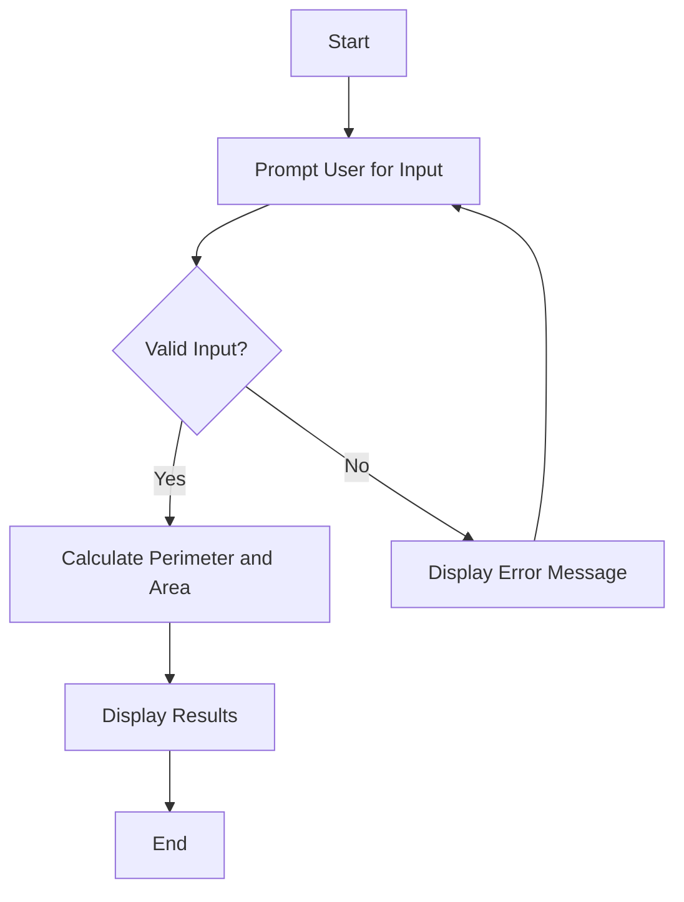

# Step 2: Make It Interactive 🎮✨

Hello again, creative coders! 🎉 Are you ready to add some interactivity to your Python project and make it come alive? Just like a video game or a fun app, your project can be interactive, too! Let's learn how to engage our users by adding simple input features! 🎈

## Why Make It Interactive? 🤔

Imagine playing a game where you can't interact. Boring, right? Interaction turns your project into a two-way conversation! Here’s why it's awesome:
- **Engage Your Users**: Interactive elements keep users interested and involved. 🎮
- **Get Useful Input**: Collecting data from users can make your program more dynamic and versatile! 🌟
- **Turn Learning into Fun**: Interaction makes learning and exploring fun for everyone! 🚀

## Let's Get Started! 🚀

### Creating a User Input Feature 📥

Let’s add a feature where users can input the side length of a square, and your program will calculate its perimeter and area. This is a great way to get users involved and make your project more dynamic!

```python
# Function to calculate perimeter and area of a square
from colorama import Fore, Style

def calculate_square_properties():
    side_length = float(input(Fore.CYAN + "Enter the side length of the square: " + Style.RESET_ALL))
    perimeter = side_length * 4
    area = side_length ** 2
    print(Fore.GREEN + f"Perimeter: {perimeter}, Area: {area}" + Style.RESET_ALL)

calculate_square_properties()
```

### Making the Experience Smooth 🌊

#### 1. **Guide Your Users**: Use clear instructions and friendly messages to guide users through the input process.
#### 2. **Validate Input**: Check if the user input is valid to prevent errors and keep the program running smoothly. 🛡️

Here's an improved version of our function with input validation:

```python
def calculate_square_properties():
    valid_input = False
    while not valid_input:
        try:
            side_length = float(input(Fore.CYAN + "Enter the side length of the square: " + Style.RESET_ALL))
            if side_length > 0:
                valid_input = True
                perimeter = side_length * 4
                area = side_length ** 2
                print(Fore.GREEN + f"Perimeter: {perimeter}, Area: {area}" + Style.RESET_ALL)
            else:
                print(Fore.RED + "Please enter a positive number." + Style.RESET_ALL)
        except ValueError:
            print(Fore.RED + "Invalid input! Please enter a number." + Style.RESET_ALL)

calculate_square_properties()
```

## Visualize the Interaction Flow 📊

Let’s look at the flow of interaction with a diagram:



## Wrap-Up 🌟

And there you have it, Mathletes! Your project is now interactive and user-friendly! By adding these features, you’re making sure that users not only learn but also have fun while they explore your Geometry Adventure. Keep experimenting and see what other interactive features you can add! 🎮🎉

In the next steps, we'll focus on optimizing our code for speed and efficiency. Stay curious, and let's keep learning together! 🧠💡