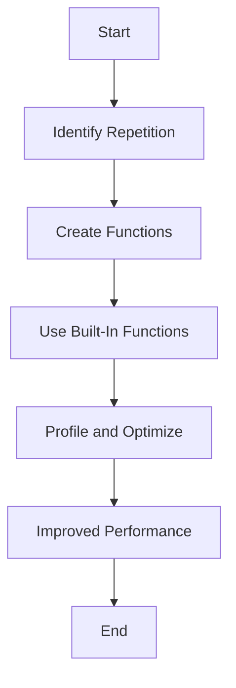

# Step 3: Optimize for Speed 🏃‍♂️💨

Hey there, speedy coders! 🚀 Are you ready to turbocharge your Python project and make it faster than ever? Just like a race car needs a tune-up to zip around the track, your code can use optimization to run smoother and quicker! Let's learn some tricks to make your project lightning-fast! ⚡

## Why Optimize Your Code? 🤔

Imagine driving a car that goes super slow. Frustrating, right? Optimizing your code ensures it runs efficiently, saving time and resources. Here’s why it’s important:
- **Faster Execution**: Speed up your program so users don’t have to wait. 🕒
- **Efficient Use of Resources**: Make the most of your computer’s power. 💻
- **Scalability**: Prepare your code to handle more data and complex operations in the future. 📈

## Let's Get Started! 🚀

### Tips for Optimizing Your Code 🛠️

1. **Avoid Repetition**: If you find yourself writing the same code again and again, put it in a function or a loop!
2. **Use Built-In Functions**: Python has many built-in functions that are optimized for performance. Use them whenever possible.
3. **Profile Your Code**: Use Python’s `cProfile` to identify parts of your code that take the most time and improve them.

### Example: Using Functions to Avoid Repetition 📄

Let's take a look at how using functions can help avoid repetition and make your code cleaner and faster:

```python
# Function to calculate and print perimeter and area
from colorama import Fore, Style

def calculate_perimeter_area(side_length):
    perimeter = side_length * 4
    area = side_length ** 2
    print(Fore.GREEN + f"Perimeter: {perimeter}, Area: {area}" + Style.RESET_ALL)

# Using the function
side_length = 5  # Example side length
calculate_perimeter_area(side_length)
```

### Profiling Your Code 🔍

Profiling helps you understand where your code spends the most time. Here’s a simple way to profile your Python code:

```python
import cProfile

def my_function():
    # Code to be profiled
    for i in range(1000):
        calculate_perimeter_area(i)

cProfile.run('my_function()')
```

## Visualize the Optimization Flow 📊

Let’s visualize how optimizing your code can improve the flow and efficiency:



## Wrap-Up 🎀

Congratulations, Mathletes! You’ve learned how to optimize your Python project for speed and efficiency! By applying these techniques, your project will not only be engaging and interactive but also quick and resourceful. Keep experimenting with different optimization strategies and watch your project zoom ahead! 🏎️💨

In our next steps, we’ll learn how to enhance user experience even further. Stay curious, and keep honing your coding skills! 🌟💡