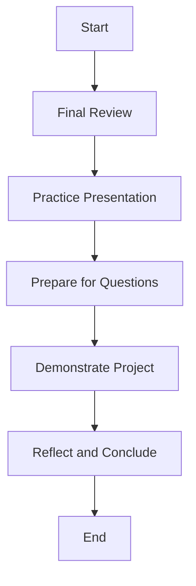

# Lesson 9: Final Review and Demonstration 🎉📚

Hello, amazing Mathletes! 🌟 Today is a special day because it's showtime! 🎬 You’ve been working hard on your Python Geometry Adventure, and now it’s time to review your project and prepare for a fantastic demonstration. Let's showcase your coding skills and creativity! Ready to impress? Let's go! 🚀

---

## Lesson Overview 🌈

In this lesson, we'll conduct a final review of your project to ensure everything runs smoothly. Then, you'll prepare to demonstrate your work, showing off all the amazing things you've learned and created. Whether it's to family, friends, or classmates, your project is ready to shine! 💡

## Lesson Objectives 🎯

- Conduct a thorough review of your Python project.
- Prepare to demonstrate your project confidently.
- Showcase your coding skills and creativity.
- Reflect on what you've learned in your Geometry Adventure.

## Showtime Preparation 🕺💃

### Step 1: Final Review Checklist ✅

Before you hit the stage, let’s make sure everything is in tip-top shape! Here’s a checklist to guide you:

- **Code Functionality:** Ensure all features work as expected. Run your code to double-check everything.
- **Code Readability:** Make sure your code is clean and easy to understand. Use comments to explain complex parts.
- **User Experience:** Walk through your project as a user. Is it engaging and easy to use?
- **Error Handling:** Test your project for errors. Try different inputs to see how your program handles them.

### Step 2: Practice Your Presentation 🎤

Practice makes perfect! Here are some tips for a successful demonstration:

- **Introduction:** Start with a brief introduction about your project and what it does.
- **Highlight Features:** Show the cool features you’ve added. Talk about the challenges you faced and how you solved them.
- **Engage Your Audience:** Use fun examples and keep your audience involved. Ask questions to make it interactive.
- **Conclusion:** End with a reflection on what you’ve learned and what you’re proud of.

### Step 3: Prepare for Questions ❓

Be ready to answer questions from your audience. Here are some common questions you might encounter:

- How did you come up with the idea for your project?
- What was the most challenging part of your project?
- If you had more time, what would you add or improve?

## Visualization with Diagrams 📊

Here’s a simple diagram to help visualize your preparation and demonstration flow:

## Conclusion 🎉

Congratulations, Mathletes! You’ve reached the grand finale of your Python Geometry Adventure. You've learned a lot, from basic coding to creating interactive and optimized projects. Now, it's time to show the world what you can do! 🎇

Remember, this is just the beginning of your coding journey. Keep exploring, experimenting, and creating. You're a coding superstar, and the sky's the limit! 🌟🚀

Good luck with your demonstration, and most importantly, have fun! You're going to do amazing things. Keep shining, Mathletes! 🌟💻

---

Continue building, exploring, and staying curious. The world of coding is waiting for you! 🤓💡