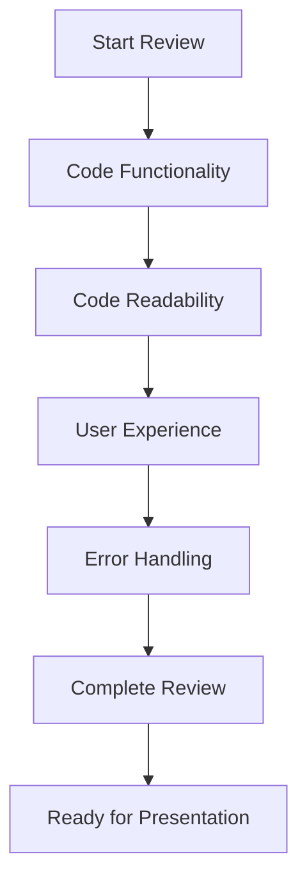

# Step 1: Final Review Checklist ✅

Welcome to Step 1 of your final preparation, Mathletes! 🎉 This is where we put on our detective hats 🕵️‍♂️🕵️‍♀️ and make sure our project is ready to dazzle and shine. Ready to dive into the checklist? Let’s do it! 🚀

## 🔍 Code Functionality Check

**Mission:** Ensure every feature is as smooth as a rollercoaster ride! 🎢

- **Test Each Feature:** Run your code and interact with each feature. Does everything work as expected? Are there any surprises?
- **Edge Cases:** Think of unusual scenarios or inputs. What happens if a user inputs something unexpected?

```python
# Example: Testing a function that calculates the area of a circle
def calculate_area(radius):
    if radius < 0:
        return "Error: Negative radius not allowed!"
    return 3.14 * (radius ** 2)

# Test cases
test_radii = [5, -3, 0, 10]
for radius in test_radii:
    print(f"Radius: {radius}, Area: {calculate_area(radius)}")
```

## 🔑 Code Readability Check

**Mission:** Make your code sparkle like a diamond! 💎

- **Comments:** Add comments to explain tricky parts of your code. Think of them as little notes to your future self or other developers.
- **Consistent Formatting:** Use consistent naming conventions and indentation. It’s like organizing your room—everything in its place!

## 🎨 User Experience Check

**Mission:** Make sure users have a blast interacting with your project! 🎈

- **Walkthrough:** Pretend you’re a user exploring your project for the first time. Is it intuitive? Is it fun?
- **Feedback:** Ask friends or family to try it out. What did they enjoy? What confused them?

## 🛡️ Error Handling Check

**Mission:** Be a superhero and catch those pesky errors! 🦸‍♂️🦸‍♀️

- **Error Messages:** Provide clear error messages to guide users when something goes wrong.

```python
try:
    # Run a piece of code
    result = calculate_area(-5)
except Exception as e:
    print(f"Oops! An error occurred: {e}")
else:
    print(f"Success! The result is: {result}")
```

## 🎯 Visualization

To help visualize our checklist, let's use a simple diagram to map out our review process:



## Conclusion 🌟

Once you've checked everything off the list, give yourself a pat on the back! 🎉 You're now ready for the next step: Practicing your presentation. Remember, preparation is the key to confidence. Keep shining, Mathletes! 🌟