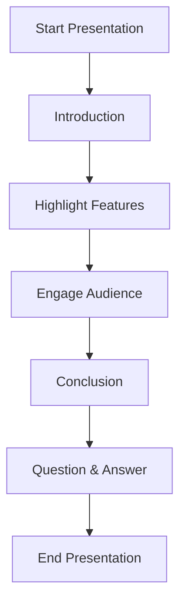

# Step 2: Practice Your Presentation 🎤

Welcome to Step 2, Mathletes! 🌟 You've done the hard work, and now it's time to get ready to share your amazing project with the world! 🌍 Let's dive into practicing your presentation so you can wow your audience with confidence and style. Ready to become a presentation pro? Let’s go! 🚀

## 🎬 Introduction: Set the Stage

**Mission:** Start strong and set the tone for your demonstration! 💪

- **Introduce Yourself:** Begin with a warm and friendly greeting. Let your audience know who you are and what you’ll be presenting.
- **Project Overview:** Give a brief summary of your project. What is it about? Why did you choose this project?

Here's a sample introduction:

```plaintext
Hello everyone! I'm Alex, and today I'm excited to show you my Python Geometry Adventure project. 🎉 In this project, I've created a program that calculates areas and perimeters for different shapes. I chose this project because I love geometry and wanted to learn how to apply it using Python. Let's dive in!
```

## 🌟 Highlight Features: Show Off Your Work

**Mission:** Shine a spotlight on the coolest parts of your project! ✨

- **Feature Walkthrough:** Guide your audience through the main features. Use visuals and examples to illustrate.
- **Challenges and Solutions:** Share a story about a challenge you faced and how you overcame it. This makes your presentation relatable and inspiring.

### Example Code Snippet:

Show how you calculate the area of a rectangle:

```python
# Function to calculate the area of a rectangle
def calculate_rectangle_area(length, width):
    return length * width

# Example usage
length = 5
width = 3
print(f"The area of the rectangle is: {calculate_rectangle_area(length, width)}")  # Output: 15
```

## 🎈 Engage Your Audience: Keep It Fun!

**Mission:** Make your presentation interactive and exciting! 🎉

- **Interactive Questions:** Ask your audience questions to keep them engaged. For example, "What shape should we calculate next?"
- **Use Fun Examples:** Incorporate examples that relate to everyday life or your audience’s interests.

## 🏁 Conclusion: Wrap It Up

**Mission:** Leave a lasting impression and reflect on your journey! 🌈

- **Reflect on Learning:** Talk about what you’ve learned during the project.
- **Express Gratitude:** Thank your audience for their time and interest.

Here's a sample conclusion:

```plaintext
Thank you all for watching my presentation! 🙏 I’ve learned a lot about coding and problem-solving through this project, and I hope you enjoyed seeing it. If you have any questions, I’d love to answer them!
```

## 👥 Prepare for Questions: Be Ready!

**Mission:** Anticipate possible questions and prepare thoughtful answers. 🤔

- **Common Questions:** Think about questions you might be asked, like "What inspired you to create this project?" or "What was the hardest part?"
- **Practice Answers:** Rehearse your answers to build confidence.

## 🎨 Visualization

To help you visualize your presentation flow, here's a simple diagram:



## Conclusion 🌟

Great job, Mathletes! 🎉 You’re now equipped to deliver a fantastic presentation that showcases your hard work and creativity. Remember, practice makes perfect, so keep rehearsing until you feel ready. You're going to do amazing! 🌟

Stay confident, be yourself, and most importantly, have fun! You're a star, and your project is the spotlight! 🌟💻

---

Prepare to shine on your big day, and remember, the world of coding is full of endless possibilities. Keep exploring and creating! 🤓💡