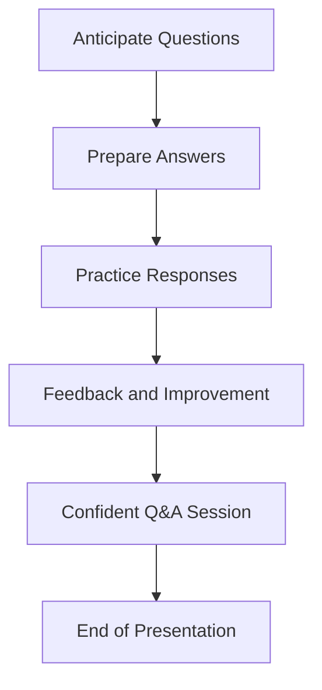

# Step 3: Prepare for Questions ❓

Welcome to Step 3, Mathletes! 🌟 You've done an incredible job preparing your project and practicing your presentation. Now, it’s time to get ready for the final part: handling questions like a pro! 🎤💡 Questions are a great opportunity to show your depth of understanding and passion for your project. Let’s dive in and make sure you’re ready to tackle anything that comes your way! 🚀

## 🤔 Anticipate Questions: Think Ahead

**Mission:** Be prepared for the questions your audience might ask! 🎯

- **Project Inspiration:** Be ready to explain what inspired you to create your project. Did a favorite game, book, or real-life experience spark your idea?
- **Challenges:** Expect questions about the hardest part of your project and how you overcame it. This is a chance to share your problem-solving skills and determination!
- **Future Improvements:** Think about what you would do if you had more time. Are there any cool features you’d like to add or improve?

### Sample Q&A:

```plaintext
**Q: What inspired you to start this project?**
A: I was inspired by my love for geometry and wanted to challenge myself by applying it in a fun way using Python. 🧠✨

**Q: What was the biggest challenge you faced?**
A: The biggest challenge was figuring out how to handle unexpected user inputs. But after some research and testing, I implemented error handling to make my program more robust! 🔧💪

**Q: If you had more time, what would you add?**
A: I’d love to add a feature that visualizes the shapes dynamically as you input the dimensions. It would make the project even more interactive and fun! 🎨📈
```

## 🎤 Practice Your Responses: Gain Confidence

**Mission:** Rehearse your answers to common questions to build confidence! 🛡️

- **Role Play:** Practice with a friend or family member. Have them ask you questions so you can practice responding on the spot.
- **Feedback:** Ask for feedback on your answers. Are they clear and engaging? Anything you need to work on?

## 🎨 Visualization

To help visualize your preparation for questions, here's a simple flow diagram:



## Conclusion 🌟

Fantastic work, Mathletes! 🎉 You're now fully prepared to handle any questions that come your way during your demonstration. Remember, questions are not just challenges—they’re opportunities to shine even brighter! 🌟

Take a deep breath, be yourself, and let your passion for your project shine through. You're going to do amazing things, and this is just the beginning of your coding adventure. Keep exploring, keep learning, and keep having fun! 🚀💻

You're ready to take the stage, Mathletes! Go out there and show them what you've got! 🌟🎤

---

Continue to dream big, and remember, the world of coding is vast and full of wonders waiting for you to discover. Keep pushing boundaries, and never stop being curious! 🤓💡